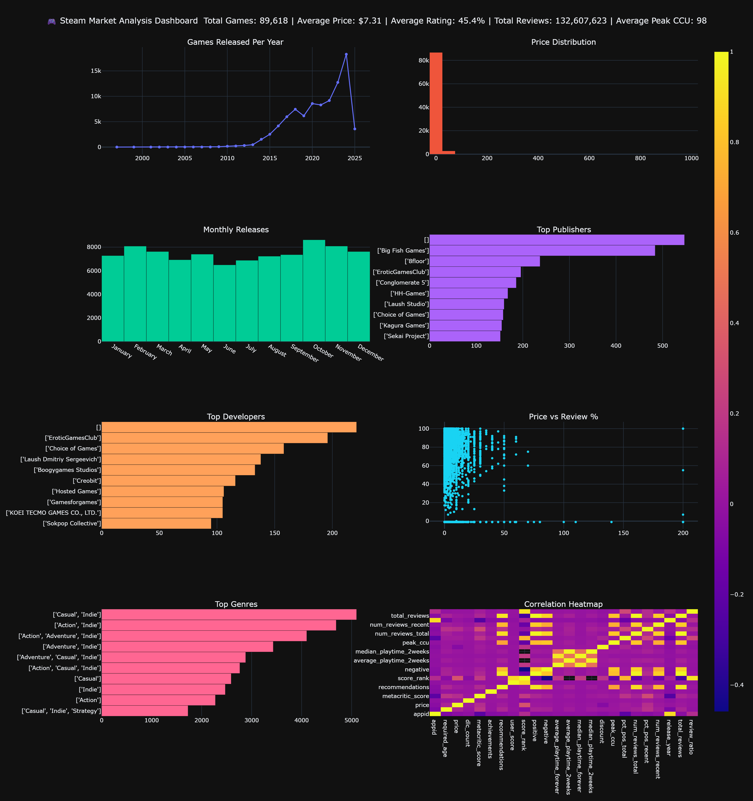

# 🎮 Steam Market Analysis
## Dashboard Preview

<p align="center">
    
</p>

---

A comprehensive Exploratory Data Analysis (EDA) project analyzing nearly **90,000 Steam games** to uncover market trends, pricing strategies, player behavior, and opportunities for game developers.

---

## 📌 Project Overview

The goal of this project is to simulate the work of a real Data Analyst by transforming raw Steam marketplace data into meaningful business insights.

Using Python and modern data analysis libraries, this project explores how game pricing, genres, publishers, reviews, and player engagement influence success on Steam.

---

## 🎯 Objectives

* Clean and prepare a large real-world dataset
* Perform Exploratory Data Analysis (EDA)
* Visualize market trends
* Discover relationships between pricing and player satisfaction
* Generate business recommendations for game developers and publishers

---

## 📊 Dataset

* **Source:** Kaggle
* **Records:** 89,618 Steam games
* **Features:** 47 columns
* **Data Includes:**

  * Game information
  * Prices
  * Genres
  * Developers
  * Publishers
  * User reviews
  * Estimated owners
  * Playtime statistics
  * Peak concurrent players
  * Steam tags
  * Platform support


🔗 https://www.kaggle.com/datasets/artermiloff/steam-games-dataset

### Download Instructions

1. Download the dataset from the Kaggle link above.
2. Extract the archive.
3. Copy `games_march2025_cleaned.csv` into the project's `data/` directory.

Expected structure:

```text
steam-market-analysis/
├── data/
│   └── games_march2025_cleaned.csv
├── src/
├── images/
├── insight.md
└── README.md
```

> **Note:** The dataset is not included in this repository because of its size and licensing. Please download it directly from Kaggle before running the project.

---

## 🛠️ Technologies Used

* Python
* Pandas
* NumPy
* Matplotlib
* Plotly
* Jupyter Notebook

---

## 📁 Project Structure

```text
steam-market-analysis/
│
├── data/
│   ├── games_march2025_cleaned.csv
│   └── games_processed.csv
│
├── images/
│
├── src/
│   ├── main.py
│   ├── eda.py
│   └── dashboard.py
│
├── insights.md
└── README.md
```

---

## 🧹 Data Preparation

The dataset was prepared by:

* Inspecting data types
* Identifying missing values
* Checking for duplicate records
* Converting release dates to datetime format
* Creating new features:

  * Release Year
  * Release Month
  * Total Reviews
  * Review Ratio

---

## 📈 Exploratory Data Analysis

The analysis answers questions such as:

* How has the number of Steam releases changed over time?
* Which genres dominate the Steam marketplace?
* What is the distribution of game prices?
* Do more expensive games receive better reviews?
* Which publishers release the most games?
* Which developers are the most active?
* When are most games released?
* What relationships exist between pricing, reviews, and player engagement?

---

## 📊 Visualizations

The project includes visualizations such as:

* Games Released Per Year
* Price Distribution
* Price vs Positive Review Percentage
* Monthly Release Distribution
* Correlation Heatmap
* Publisher Rankings
* Developer Rankings
* Interactive Plotly Charts

---

## 💡 Key Skills Demonstrated

* Data Cleaning
* Feature Engineering
* Exploratory Data Analysis (EDA)
* Statistical Summaries
* Data Visualization
* Business Insight Generation
* Python Programming
* Analytical Thinking

---

## 📌 Business Insights

The analysis highlights market trends that can help answer questions such as:

* Which genres appear to be the most competitive?
* What pricing strategies are most common?
* Does price influence player satisfaction?
* Which release periods may offer better visibility?
* How concentrated is the Steam publishing market?

Detailed findings are available in **insights.md**.

---

## 🚀 Future Improvements

Potential extensions for this project include:

* Interactive dashboards using Dash or Streamlit
* Genre sentiment analysis
* Recommendation system experiments
* Time-series forecasting of Steam releases
* Machine learning models for predicting game success

---

## 👨‍💻 Author

Created as part of my **AI & Data Analysis Learning Journey**, a portfolio series focused on building practical projects in Python, Machine Learning, and Artificial Intelligence.
