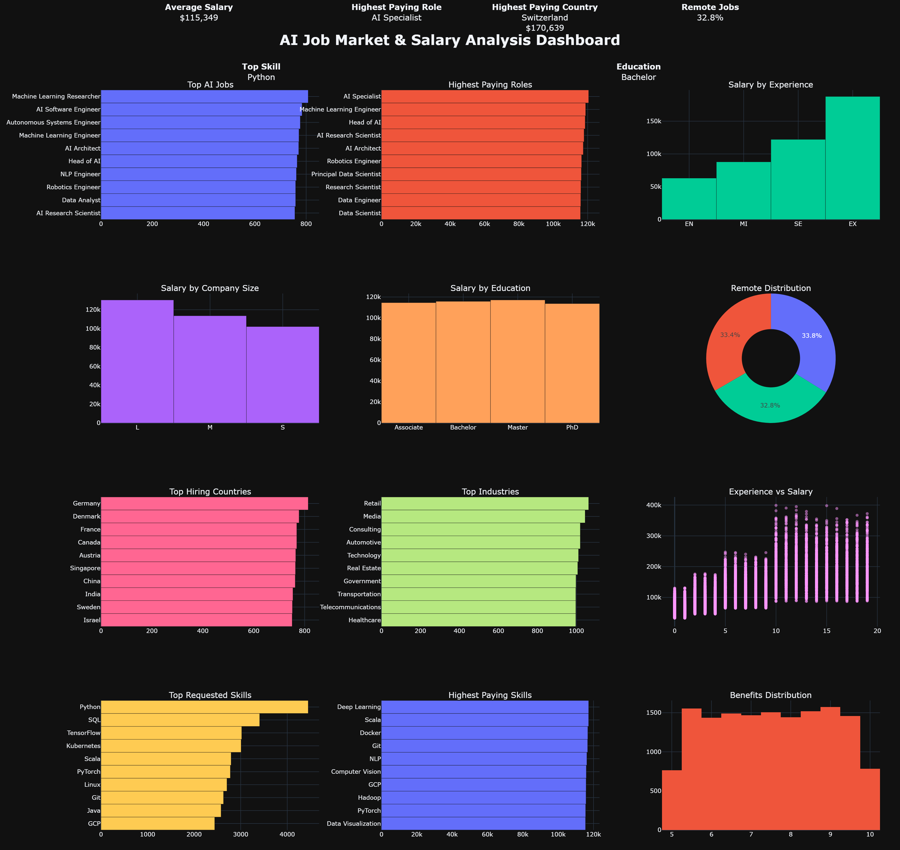

# 🤖 AI Job Market & Salary Analysis

<p align="center">
  
</p>

<p align="center">


</p>

---

# 📖 Executive Summary

This project analyzes **15,000 AI job postings** from around the world to understand current hiring trends, salary distributions, required skills, experience levels, and industry demand.

The objective is not only to explore the dataset, but also to answer real business and career questions through data analysis and interactive visualizations.

The final result is an executive dashboard that summarizes the global AI job market using Python, Pandas, Matplotlib, and Plotly.

---

# 🎯 Business Questions

This analysis answers questions such as:

- Which AI roles pay the highest salaries?
- Which countries offer the highest compensation?
- Which AI jobs are most common?
- Does experience significantly increase salary?
- Which industries invest the most in AI talent?
- What education level is most requested?
- Which technical skills appear most frequently?
- Which skills are associated with the highest salaries?
- What percentage of AI jobs are fully remote?
- How are benefits distributed across companies?

---

# 📊 Dashboard Features

The interactive dashboard contains:

- Executive KPI Summary
- Average Salary
- Highest Paying AI Role
- Highest Paying Country
- Remote Work Percentage
- Most Requested Skill
- Most Common Education Level
- Top AI Job Roles
- Highest Paying Roles
- Salary by Experience Level
- Salary by Company Size
- Salary by Education
- Remote Work Distribution
- Top Hiring Countries
- Top Industries
- Experience vs Salary
- Top Requested Skills
- Highest Paying Skills
- Benefits Score Distribution

---

# 🛠 Technologies Used

- Python
- Pandas
- NumPy
- Matplotlib
- Plotly
- VS Code

---

# 📁 Project Structure

```
ai-job-analysis/

│
├── data/
│   ├── ai_jobs.csv
│   └── ai_jobs_processed.csv
│
├── images/
│   ├── executive_dashboard.png
│   ├── executive_dashboard.html
│   └── ...
│
├── src/
│   ├── main.py
│   ├── eda.py
│   ├── skills_analysis.py
│   └── dashboard.py
│
├── insights.md
└── README.md
```

---

# 📈 Data Analysis Workflow

```
Dataset
      ↓
Cleaning
      ↓
Feature Engineering
      ↓
Exploratory Data Analysis
      ↓
Visualization
      ↓
Interactive Dashboard
      ↓
Business Insights
      ↓
Career Recommendations
```

---

# 💡 Key Insights

Examples of insights extracted from the analysis include:

- Salary increases significantly with experience level.
- Remote AI jobs represent a substantial portion of the market.
- Certain technical skills consistently appear across multiple AI roles.
- Company size influences salary distribution.
- Education level alone is less predictive than experience and technical skills.
- AI hiring is concentrated within a relatively small number of countries and industries.

More detailed findings are available in **insights.md**.

---

# 🚀 Career Recommendations

Based on the analysis, aspiring AI professionals should prioritize learning:

- Python
- SQL
- Machine Learning
- Deep Learning
- Large Language Models (LLMs)
- Cloud Platforms
- Data Analysis
- Git & GitHub

Building practical projects and maintaining a strong portfolio remain among the strongest indicators of employability.

---

# 📊 Dataset

**Source**

https://www.kaggle.com/datasets/bismasajjad/global-ai-job-market-and-salary-trends-2025

The dataset contains approximately **15,000 AI job listings**, including:

- Salary
- Experience Level
- Employment Type
- Company Size
- Industry
- Required Skills
- Education
- Remote Ratio
- Benefits Score
- Company Location

The dataset is **not included** in this repository because of licensing and repository size.

Download it from Kaggle and place it inside:

```
data/
```

---

# 📌 Future Improvements

- Streamlit dashboard
- Salary prediction model
- AI career recommendation system
- Skill recommendation engine
- Country comparison dashboard
- Live job market integration
- Machine Learning forecasting

---

# 👨‍💻 Author

**Sami Mahdadi**

AI Developer • Data Analyst • Game Developer

GitHub:
https://github.com/sxmimhd

---

## ⭐ Project Goal

This project is the second project of my AI portfolio journey.

The objective is to demonstrate the complete workflow of a professional data analyst:

- Data Collection
- Data Cleaning
- Feature Engineering
- Exploratory Data Analysis (EDA)
- Data Visualization
- Dashboard Development
- Business Storytelling
- Actionable Recommendations