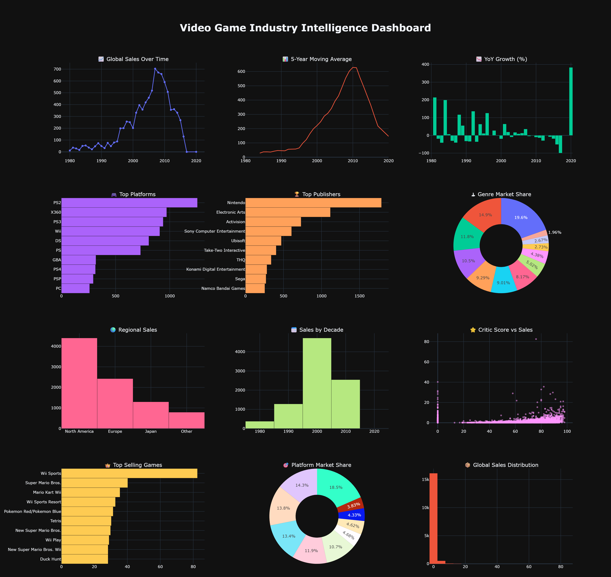

# 🎮 Video Game Industry Intelligence

<p align="center">
  
</p>

<p align="center">
An advanced data analytics project exploring historical trends in the global video game industry using Python, Pandas and Plotly.
</p>

---

# Executive Summary

The global video game industry has evolved dramatically over the past four decades, with shifts in dominant platforms, changing player preferences, and regional market differences shaping the industry's growth.

This project analyzes thousands of video game releases to answer important business questions such as:

* Which platforms generated the most sales?
* Which genres dominate the market?
* Which publishers consistently outperform competitors?
* How has the industry evolved over time?
* Which regions contribute the most revenue?
* Is there a relationship between review scores and commercial success?
* What long-term market trends can be identified?

The objective is to transform raw historical sales data into actionable business intelligence through professional data analysis and interactive dashboards.

---

# Project Objectives

* Perform data cleaning and preprocessing
* Explore industry-wide trends
* Analyze global and regional sales
* Identify market leaders
* Study platform and genre evolution
* Perform time-series analysis
* Calculate business metrics
* Build an interactive executive dashboard
* Produce business recommendations supported by data

---

# Dataset

This project uses the **Video Game Sales with Ratings** dataset.

It contains information about:

* Video game titles
* Platforms
* Release years
* Publishers
* Genres
* Regional sales
* Global sales
* Critic scores
* User scores
* ESRB ratings

**Dataset Source**

https://www.kaggle.com/datasets/rush4ratio/video-game-sales-with-ratings

The dataset is **not included** in this repository due to licensing and file size. Download it manually from Kaggle and place it inside:

```text
video-game-sales/
└── data/
    └── video_games_sales.csv
```

---

# Project Structure

```text
video-game-sales/

│
├── data/
│   ├── vg_sales.csv
│   └── video_games_processed.csv
│
├── images/
│   ├── executive_dashboard.png
│   ├── top_selling_games.png
│   ├── platform_sales.png
│   ├── genre_sales.png
│   ├── publisher_sales.png
│   ├── regional_market_share.png
│   ├── sales_distribution.png
│   ├── critic_vs_sales.png
│   ├── user_vs_sales.png
│   └── decade_sales.png
│
├── src/
│   ├── main.py
│   ├── cleaning.py
│   ├── eda.py
│   ├── trends.py
│   ├── analytics.py
│   └── dashboard.py
│
├── insights.md
└── README.md
```

---

# Workflow

## 1. Data Loading

The dataset is loaded using **Pandas**.

Initial inspection includes:

* Dataset dimensions
* Data types
* Missing values
* Duplicate detection
* Descriptive statistics

---

## 2. Data Cleaning

Cleaning includes:

* Removing incomplete records
* Handling missing critic and user scores
* Converting release dates
* Creating decade categories
* Standardizing numeric columns
* Preparing data for visualization

---

## 3. Exploratory Data Analysis (EDA)

Several visualizations are created to understand the market.

### Top Selling Games

Identifies the highest-selling games in history.

---

### Platform Performance

Compares total sales generated by each gaming platform.

---

### Genre Analysis

Shows which genres dominate the market.

---

### Publisher Comparison

Ranks publishers based on total global sales.

---

### Regional Market Share

Compares:

* North America
* Europe
* Japan
* Other Regions

---

### Sales Distribution

Examines how game sales are distributed across the industry.

---

### Critic Score vs Sales

Explores whether higher critic scores correlate with stronger sales.

---

### User Score vs Sales

Measures the relationship between player ratings and commercial performance.

---

### Sales by Decade

Illustrates how the gaming market has evolved across different eras.

---

# Advanced Trend Analysis

Project 3 introduces advanced business analytics beyond standard EDA.

## Time-Series Analysis

Analyzes yearly industry performance.

---

## Moving Average

A 5-year moving average smooths yearly fluctuations to reveal long-term market direction.

---

## Year-over-Year Growth (YoY)

Measures annual growth or decline in global sales.

---

## Market Share Analysis

Compares platform dominance based on cumulative sales.

---

## Publisher Intelligence

Evaluates publisher performance and competitive positioning.

---

## Genre Evolution

Tracks changing player preferences over time.

---

# Executive Dashboard

The interactive Plotly dashboard combines:

* Executive KPI cards
* Global sales trends
* Moving averages
* Year-over-Year growth
* Top platforms
* Top publishers
* Genre market share
* Regional sales
* Sales by decade
* Critic score analysis
* Top-selling games
* Platform market share
* Sales distribution

The dashboard is exported as both HTML and PNG for easy sharing.

---

# Technologies Used

* Python
* Pandas
* NumPy
* Plotly
* Matplotlib

---

# Key Findings

* Nintendo remains one of the strongest publishers in gaming history.
* Platform dominance shifts over time as console generations evolve.
* Action, Sports, and Shooter games consistently generate high sales.
* North America represents the largest market, followed by Europe.
* Critic scores alone do not guarantee commercial success.
* A small number of blockbuster titles account for a significant share of total industry sales.
* Industry growth accelerated during major console generations before stabilizing.

---

# Business Recommendations

Based on the analysis:

* Invest in consistently successful genres while monitoring emerging trends.
* Diversify platform support to maximize market reach.
* Prioritize North American and European markets for global releases.
* Use critic reviews as one quality signal rather than the sole predictor of success.
* Monitor long-term platform trends when planning future investments.
* Combine historical sales data with market forecasting for strategic decision-making.

---

# Future Improvements

* Interactive Streamlit dashboard
* Sales forecasting using Machine Learning
* Genre recommendation models
* Platform lifecycle prediction
* Time-series forecasting with Prophet
* SQL integration for large-scale analytics
* Automated reporting
* Real-time market dashboard

---

# Learning Outcomes

This project strengthened my understanding of:

* Data preprocessing
* Exploratory Data Analysis
* Business Intelligence
* Time-series analysis
* Trend analysis
* Moving averages
* Year-over-Year growth
* Market share analysis
* Interactive dashboards
* Executive reporting
* Data storytelling

---

# Bootcamp Progress

✅ Project 1 — Steam Market Analysis

Focused on data cleaning, exploratory analysis, and visualization.

✅ Project 2 — AI Jobs & Salaries Analysis

Added executive dashboards, storytelling, and career insights.

✅ Project 3 — Video Game Industry Intelligence

Introduced advanced analytics, trend analysis, time-series techniques, market share evaluation, and executive business reporting.

Each project builds on the previous one, progressively developing stronger data analysis and business intelligence skills.

# 👨‍💻 Author

**Sami Mahdadi**

AI Developer • Data Analyst • Game Developer

GitHub:
https://github.com/sxmimhd
