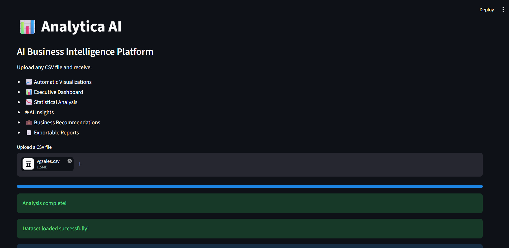
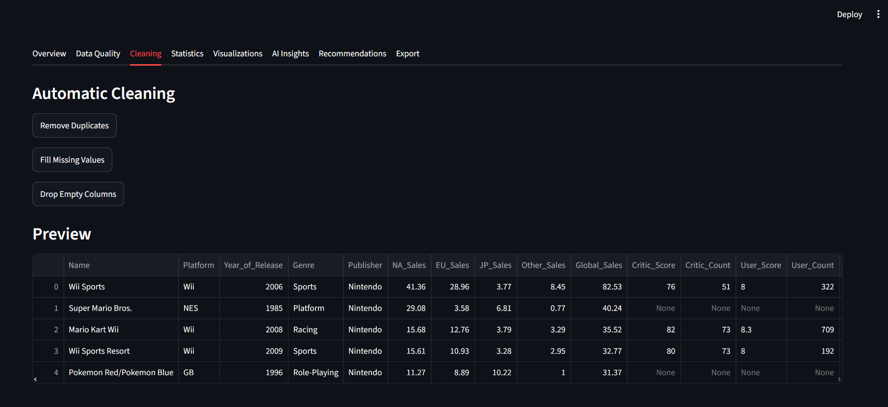
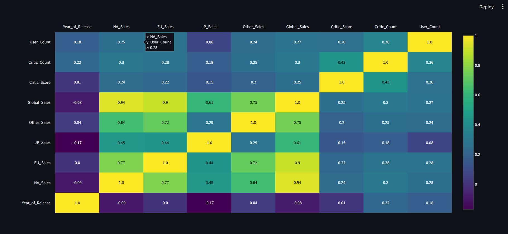
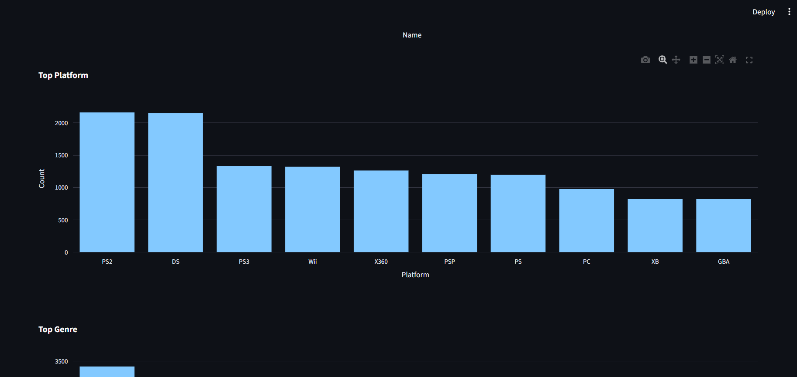
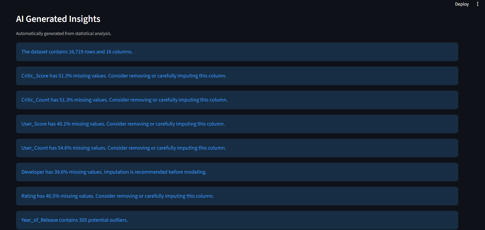
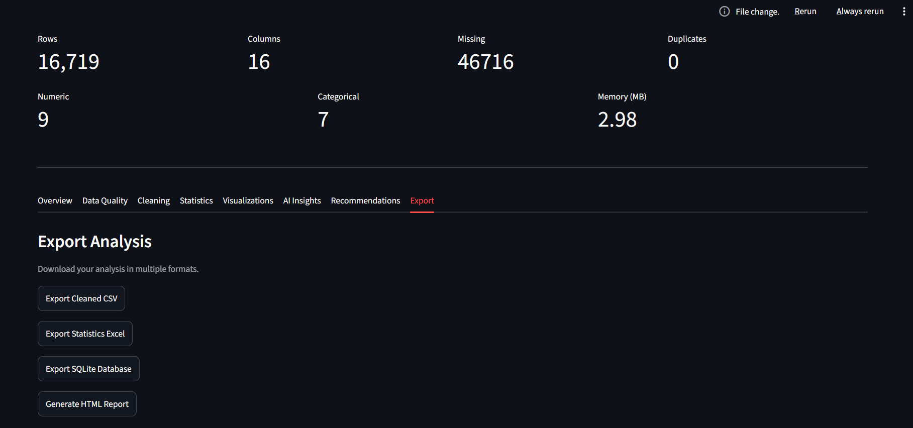

# 📊 Analytica AI

### Upload any CSV. Generate interactive dashboards, statistical analysis, and AI-powered business insights in seconds.

<p align="center">
  
</p>

<p align="center">
<strong>Upload any CSV. Receive an intelligent business intelligence report in seconds.</strong>
</p>

---

# 🚀 Executive Summary

**Analytica AI** is an intelligent Business Intelligence platform built with **Python** and **Streamlit** that automatically analyzes any tabular dataset without requiring manual coding.

Instead of creating dashboards for a single dataset, Analytica AI adapts to the uploaded data, performs exploratory data analysis, generates professional visualizations, computes statistical summaries, detects data quality issues, and produces actionable business insights.

The goal is to automate the first stages of every data analytics project and provide decision-makers with meaningful information in a simple and interactive interface.

---

# 🎯 Project Objectives

This platform was designed to answer one simple question:

> **"What valuable information can we automatically discover from any CSV dataset?"**

Analytica AI transforms raw datasets into understandable reports by combining:

* Automatic data profiling
* Data quality assessment
* Statistical analysis
* Interactive visualizations
* Correlation analysis
* AI-style insight generation
* Business recommendations

---

# ✨ Features

## 📁 Universal CSV Upload

Upload almost any structured CSV dataset.

The platform automatically detects:

* Numerical columns
* Categorical columns
* Date columns
* Dataset dimensions
* Memory usage
* Missing values
* Duplicate rows

---

## 📊 Executive Dashboard

Professional KPI cards summarize the uploaded dataset instantly.

Metrics include:

* Total Rows
* Total Columns
* Numeric Features
* Categorical Features
* Missing Values
* Duplicate Rows
* Memory Usage

---

## 🧹 Automatic Data Quality Assessment

Analytica AI evaluates dataset quality by detecting:

* Missing values
* Missing percentages
* Duplicate rows
* Constant columns
* Invalid data types

<p align="center">
  
</p>

This provides an immediate understanding of whether the dataset is suitable for further analysis.

---

## 📈 Statistical Analysis Engine

For every numerical feature, the platform calculates:

* Mean
* Median
* Mode
* Standard Deviation
* Variance
* Minimum
* Maximum
* Quartiles
* Skewness
* Kurtosis

These statistics help summarize the overall distribution of the data before deeper analysis.

---

## 📊 Adaptive Visualization Engine

Instead of relying on fixed charts, Analytica AI generates visualizations based on detected column types.

Supported visualizations include:

* Histograms
* Boxplots
* Scatter Plots
* Correlation Heatmaps
* Pie Charts
* Bar Charts
* Timeline Analysis (when date columns exist)

<p align="center">
  
</p>

<p align="center">
  
</p>

All visualizations are interactive through Plotly.

---

## 🔍 Correlation Analysis

The application automatically computes correlation matrices for numerical variables and visualizes relationships through an interactive heatmap.

This allows users to quickly identify:

* Strong positive relationships
* Strong negative relationships
* Independent variables
* Potential predictors

---

## 🧠 Insight Generation

The platform automatically generates analytical observations from the uploaded dataset.

Examples include:

* Data quality observations
* Distribution characteristics
* Correlation highlights
* Dataset composition
* Statistical findings

<p align="center">
  
</p>

The objective is to reduce the manual effort required during exploratory data analysis.

---

## 💡 Recommendation Engine

Based on the generated insights, Analytica AI proposes business-oriented recommendations.

Examples include:

* Improve data quality before modeling
* Investigate highly skewed variables
* Monitor strongly correlated metrics
* Address missing information
* Prioritize variables with high analytical value

---

## 🎯 Dataset Detection

The platform attempts to classify uploaded datasets into categories such as:

* Sales
* Finance
* Human Resources
* Healthcare
* Marketing
* Movies
* Gaming
* Retail
* Generic Business Data

This allows recommendations to better match the business context.

---

# 🏗️ Project Architecture

```
CSV Upload
      │
      ▼
Dataset Loader
      │
      ▼
Automatic Profiling
      │
      ▼
Data Quality Analysis
      │
      ▼
Statistical Analysis
      │
      ▼
Visualization Engine
      │
      ▼
Correlation Analysis
      │
      ▼
Insight Engine
      │
      ▼
Recommendation Engine
      │
      ▼
Interactive Dashboard
```

---

# 📂 Project Structure

```
ai-business-intelligence/

│
├── app.py
│
├── src/
│   ├── loader.py
│   ├── cleaner.py
│   ├── analyzer.py
│   ├── statistics.py
│   ├── visualizer.py
│   ├── insights.py
│   ├── recommender.py
│   └── utils.py
│
├── uploads/
├── reports/
├── exports/
├── assets/
├── requirements.txt
└── README.md
```

---

# 🛠️ Technology Stack

### Programming

* Python

### Data Analysis

* Pandas
* NumPy

### Statistics

* SciPy

### Visualization

* Plotly

### Dashboard

* Streamlit

### Database

* SQLite

### File Processing

* OpenPyXL

---

# 📋 Supported Analyses

✔ Dataset Profiling

✔ Data Cleaning Assessment

✔ Statistical Summary

✔ Missing Value Analysis

✔ Correlation Analysis

✔ Distribution Analysis

✔ Interactive Visualizations

✔ Business Intelligence Insights

✔ Recommendation Generation

---

# 🎯 Business Value

Analytica AI helps transform raw datasets into actionable information by:

* Reducing exploratory analysis time
* Highlighting potential data quality issues
* Providing interactive dashboards
* Supporting data-driven decision making
* Automating repetitive analytics workflows

<p align="center">
  
</p>

---

# 🚀 Future Improvements

Future versions of Analytica AI may include:

* LLM-powered report generation
* Natural language querying
* Automatic forecasting
* Time-series anomaly detection
* Predictive machine learning models
* Smart chart recommendation
* Advanced feature engineering
* PDF and PowerPoint report export
* Cloud deployment
* Multi-user workspace

---

# 📸 Dashboard Preview

The interactive dashboard includes:

* Executive KPIs
* Dataset overview
* Data quality report
* Statistical summaries
* Adaptive visualizations
* Correlation heatmaps
* AI-generated insights
* Business recommendations

---

# 🎓 Skills Demonstrated

This project demonstrates practical experience with:

* Python
* Pandas
* NumPy
* Streamlit
* Plotly
* Data Cleaning
* Exploratory Data Analysis (EDA)
* Statistical Analysis
* Business Intelligence
* Dashboard Development
* Data Visualization
* Insight Generation
* Recommendation Systems
* Software Architecture

---

# 📈 Portfolio Context

Analytica AI represents the final project of a five-project Data Analytics portfolio focused on progressively building real-world business intelligence skills.

Previous projects explored:

* Market Analysis
* AI Job Intelligence
* Video Game Industry Analytics
* Netflix Recommendation Analytics

This final project generalizes those techniques into a reusable analytics platform capable of working with virtually any structured dataset.

---

# 📜 License

This project is released for educational and portfolio purposes.

---

<p align="center">

**Built with Python, Streamlit, Plotly, and Business Intelligence principles.**

</p>
