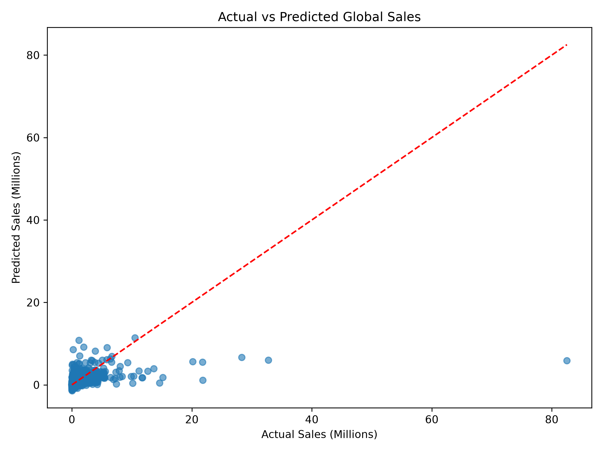
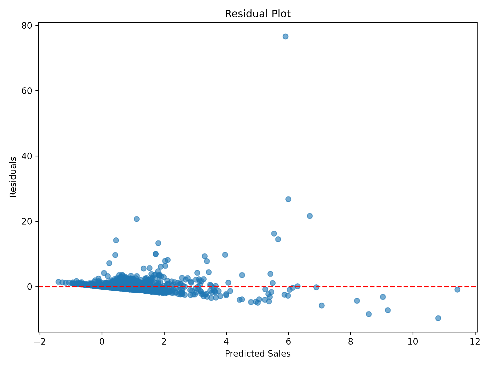
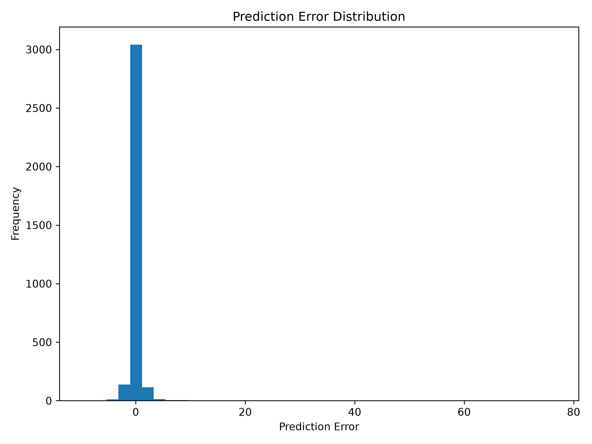
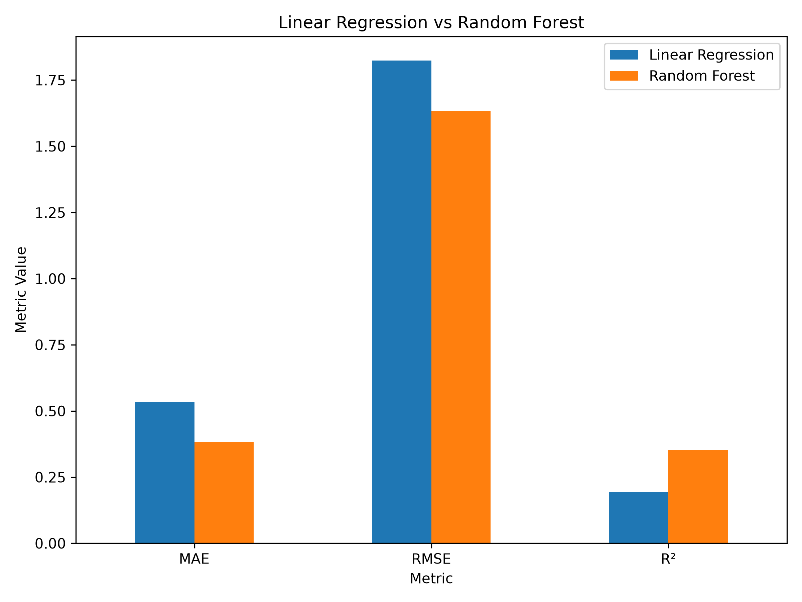
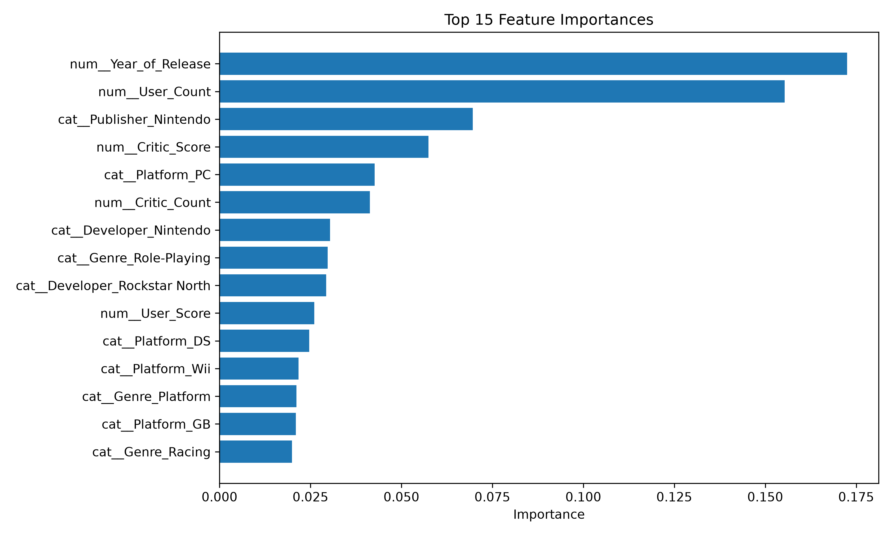

# 🎮 Video Game Sales Prediction using Machine Learning

Predicting global video game sales using Machine Learning, from raw data to a trained and explainable regression model.

---

## 📷 Project Overview

This project demonstrates a complete end-to-end Machine Learning workflow for predicting **Global Video Game Sales** using historical game information.

Unlike many introductory ML tutorials that focus only on training a model, this project follows a professional machine learning pipeline including data preparation, preprocessing, model comparison, evaluation, explainability, and model persistence.

The objective is not simply to obtain a prediction, but to understand every stage involved in building a reliable regression model.

---

## 📸 Project Screenshots

### Actual vs Predicted Sales



---

### Residual Analysis



---

### Prediction Error Distribution



---

### Model Comparison



---

### Feature Importance



---

# 📌 Business Problem

Video game publishers invest millions of dollars into developing and marketing new titles.

An important business question is:

> **Can we estimate a game's global sales using information available before or shortly after release?**

Accurate sales prediction can support:

* Marketing budget allocation
* Investment decisions
* Market analysis
* Sales forecasting
* Publisher strategy
* Risk assessment

---

# 📂 Dataset

The dataset contains historical information about thousands of video games, including:

* Platform
* Genre
* Publisher
* Developer
* Release Year
* Critic Scores
* User Scores
* ESRB Rating
* Regional Sales
* Global Sales

For this project:

**Target Variable**

* Global_Sales

Selected Features

* Platform
* Year_of_Release
* Genre
* Publisher
* Critic_Score
* Critic_Count
* User_Score
* User_Count
* Developer
* Rating

To prevent **data leakage**, regional sales columns were intentionally excluded since they directly contribute to the target variable.

---

# 🧠 Machine Learning Workflow

```text
Raw Data
      │
      ▼
Data Cleaning
      │
      ▼
Feature Selection
      │
      ▼
Missing Value Handling
      │
      ▼
Categorical Encoding
      │
      ▼
Train/Test Split
      │
      ▼
Linear Regression (Baseline)
      │
      ▼
Random Forest Regression
      │
      ▼
Evaluation
      │
      ▼
Feature Importance
      │
      ▼
Model Persistence
```

---

# 🛠 Technologies Used

* Python
* Pandas
* NumPy
* Scikit-learn
* Matplotlib
* Plotly
* Joblib
* Jupyter Notebook

---

# ⚙ Data Preparation

Several preprocessing steps were applied before training the models.

### Data Cleaning

* Converted `User_Score` from string to numeric values
* Replaced `"tbd"` values with missing values
* Removed data leakage features
* Selected relevant predictive features

### Missing Values

Numerical features:

* Median Imputation

Categorical features:

* Most Frequent Imputation

### Encoding

Categorical variables were transformed using **One-Hot Encoding**.

The preprocessing workflow was implemented using:

* Pipeline
* ColumnTransformer
* SimpleImputer
* OneHotEncoder

This ensures consistent preprocessing during both training and future predictions.

---

# 🤖 Models

## 1. Linear Regression

The first model served as the baseline regression algorithm.

Advantages:

* Simple
* Fast
* Highly interpretable

Limitations:

* Assumes linear relationships
* Cannot capture complex feature interactions

---

## 2. Random Forest Regressor

The second model improves prediction by combining multiple decision trees.

Advantages:

* Captures non-linear relationships
* Handles feature interactions
* Generally produces more accurate predictions on structured datasets

---

# 📊 Model Evaluation

Regression models were evaluated using:

* Mean Absolute Error (MAE)
* Mean Squared Error (MSE)
* Root Mean Squared Error (RMSE)
* R² Score

## Results

| Metric   | Linear Regression | Random Forest |
| -------- | ----------------: | ------------: |
| MAE      |        **0.5342** |    **0.3837** |
| RMSE     |        **1.8236** |    **1.6344** |
| R² Score |        **0.1944** |    **0.3529** |

Random Forest consistently outperformed the Linear Regression baseline across every evaluation metric.

---

# 📈 Model Explainability

To better understand model behavior, feature importance was extracted from the Random Forest model.

This analysis highlights which features contributed the most to predicting global sales.

Explainable models are essential for building trustworthy machine learning systems and communicating results to stakeholders.

---

# 💾 Model Persistence

The trained Random Forest model was saved using **Joblib**.

This allows the complete preprocessing pipeline and trained model to be reused without retraining.

Saved model:

```text
models/video_game_sales_rf.pkl
```

---

# 📚 Key Machine Learning Concepts in This Project

* Supervised Learning
* Regression
* Features & Target Variables
* Feature Selection
* Missing Value Imputation
* One-Hot Encoding
* Train/Test Split
* Machine Learning Pipelines
* Linear Regression
* Random Forest Regression
* MAE
* MSE
* RMSE
* R² Score
* Model Comparison
* Feature Importance
* Model Persistence

---

# ⚠ Limitations

Several factors influencing game sales are not included in the dataset, including:

* Marketing budget
* Franchise popularity
* Release timing
* Competition from other games
* Pricing strategy
* Social media influence
* Community engagement

These missing variables limit the predictive performance of the models.

---

# 🚀 Future Improvements

Possible future enhancements include:

* Hyperparameter tuning
* Cross-validation
* Additional regression algorithms
* Feature engineering
* Ensemble learning
* Advanced explainability techniques
* Interactive prediction application

---

# 📁 Project Structure

```text
video-game-sales-ml/
│
├── data/
├── models/
│   └── video_game_sales_rf.pkl
│
├── notebooks/
│   └── regression.ipynb
│
├── screenshots/
│   ├── actual_vs_predicted.png
│   ├── error_distribution.png
│   ├── feature_importance.png
│   ├── model_comparison.png
│   └── residual_plot.png
│
├── README.md
└── .gitignore
```

---

# 🎯 Conclusion

This project demonstrates a complete regression workflow using modern Machine Learning practices.

Starting from raw data, the project covers preprocessing, feature engineering, model training, evaluation, comparison, explainability, and persistence while following best practices to avoid data leakage.

Rather than focusing solely on model accuracy, the project emphasizes understanding the full machine learning lifecycle, making it a strong portfolio example of an end-to-end regression project.
