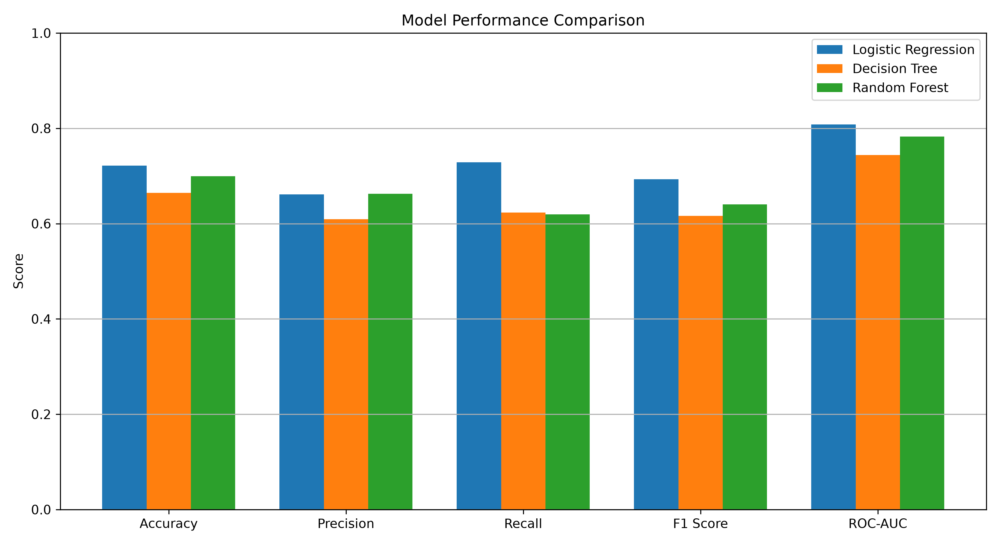
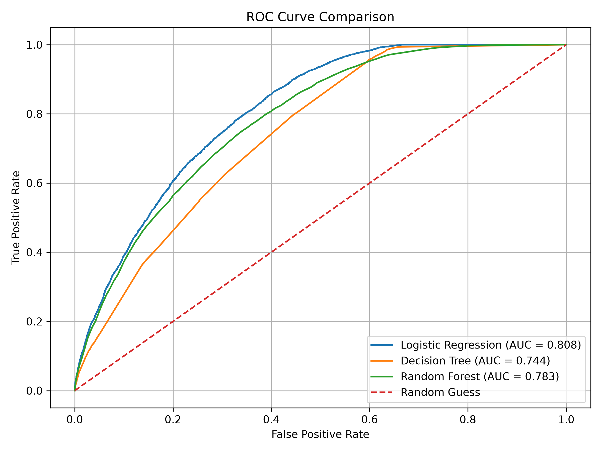
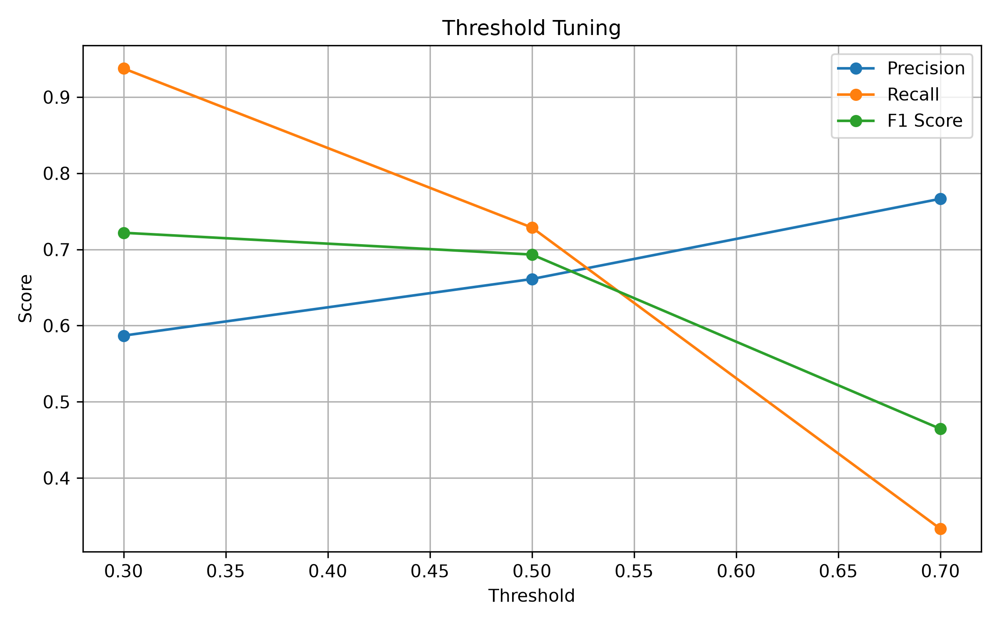
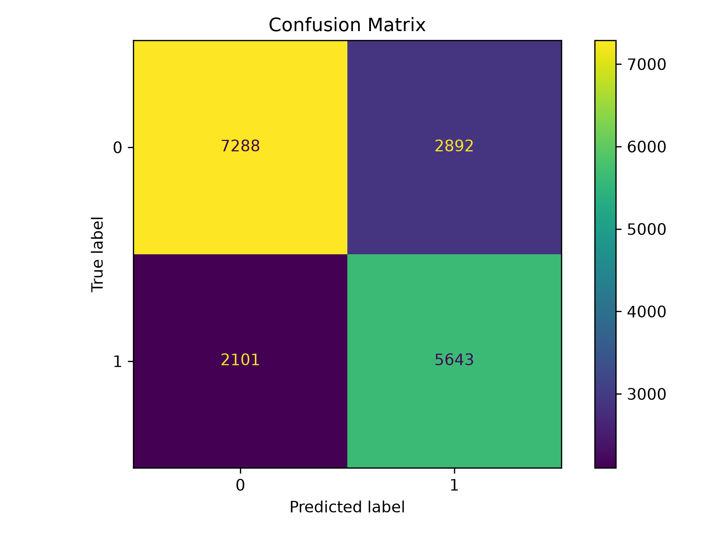
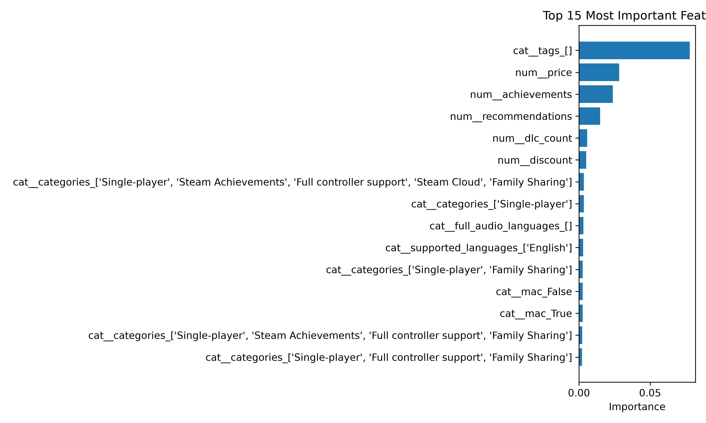

# 🎮 Steam Review Success Prediction using Machine Learning

> Predicting whether a Steam game will receive **positive reviews** using Machine Learning, from raw data to a fully evaluated and explainable classification pipeline.

---

<p align="center">
  
</p>

---

## 📖 Overview

Machine Learning is more than training a model.

A professional workflow requires understanding the business problem, preparing data correctly, selecting appropriate algorithms, evaluating results with multiple metrics, interpreting predictions, and comparing different approaches.

This project demonstrates an end-to-end **classification pipeline** built using Scikit-learn.

Three different machine learning algorithms are trained and compared to determine which one best predicts whether a Steam game will achieve positive community reception.

---

## 🎯 Business Problem

Before launching or promoting a game, publishers want to estimate its probability of receiving positive reviews.

Instead of relying solely on intuition, historical Steam data can be used to build a predictive model capable of estimating review success.

The prediction target is binary:

* ✅ Successful
* ❌ Not Successful

This transforms the problem into a **Binary Classification** task.

---

## 🧠 Machine Learning Concepts Covered

### Machine Learning Fundamentals

* Supervised Learning
* Binary Classification
* Features & Target Variables
* Probability Prediction
* Decision Thresholds

### Data Preparation

* Feature Engineering
* Target Engineering
* Missing Value Handling
* One-Hot Encoding
* Standardization
* Pipelines
* Stratified Train/Test Split

### Classification Algorithms

* Logistic Regression
* Decision Tree Classifier
* Random Forest Classifier

### Evaluation Metrics

* Accuracy
* Precision
* Recall
* F1 Score
* ROC Curve
* ROC-AUC
* Confusion Matrix

### Model Analysis

* Threshold Tuning
* Feature Importance
* Model Comparison
* Probability Interpretation

### Model Persistence

* Joblib Serialization
* Pipeline Saving & Loading

---

# 📂 Dataset

Steam Games Dataset

Approximately **89,000 Steam games** containing metadata including:

* Price
* Supported Platforms
* Genres
* Categories
* Achievements
* Recommendations
* Languages
* DLC Count
* User Scores
* Review Statistics

A binary target variable (**review_success**) was engineered from review percentages to train classification models.

---

# ⚙️ Machine Learning Workflow

```text
Raw Dataset
      │
      ▼
Data Cleaning
      │
      ▼
Feature Engineering
      │
      ▼
Target Engineering
      │
      ▼
Train/Test Split
      │
      ▼
Data Preprocessing
(Imputation + Encoding + Scaling)
      │
      ▼
Logistic Regression
Decision Tree
Random Forest
      │
      ▼
Evaluation
      │
      ▼
ROC Analysis
Threshold Tuning
Feature Importance
Model Comparison
      │
      ▼
Saved Models (.pkl)
```

---

# 🛠️ Technologies

* Python
* Pandas
* NumPy
* Matplotlib
* Scikit-learn
* Joblib
* Jupyter Notebook

---

# 📊 Exploratory Analysis

Before training the models, the dataset was explored to understand:

* Missing values
* Numerical features
* Categorical features
* Class balance
* Feature distributions

The engineered target produced a reasonably balanced classification problem:

* Successful Games: **43.2%**
* Not Successful: **56.8%**

---

# 🤖 Models Trained

## 1️⃣ Logistic Regression

The baseline classification model.

Introduced:

* Probability outputs
* Sigmoid Function
* Classification Thresholds

---

## 2️⃣ Decision Tree

Introduced tree-based learning concepts:

* Nodes
* Splits
* Tree Depth
* Gini Impurity
* Overfitting

---

## 3️⃣ Random Forest

An ensemble model combining multiple decision trees to improve generalization and reduce variance.

---

# 📈 Model Performance

<p align="center">
  
</p>

| Model               | Accuracy   | Precision  | Recall     | F1 Score   | ROC-AUC   |
| ------------------- | ---------- | ---------- | ---------- | ---------- | --------- |
| Logistic Regression | **72.14%** | 66.12%     | **72.87%** | **69.33%** | **0.808** |
| Decision Tree       | 66.44%     | 60.90%     | 62.32%     | 61.60%     | 0.744     |
| Random Forest       | 69.93%     | **66.28%** | 61.92%     | 64.02%     | 0.783     |

### Best Performing Model

🏆 **Logistic Regression**

Despite being the simplest algorithm, Logistic Regression achieved the highest overall performance across Accuracy, Recall, F1 Score, and ROC-AUC, demonstrating that simpler models can outperform more complex approaches depending on the dataset.

---

# 📉 ROC Curve Comparison

<p align="center">
  
</p>

ROC curves compare model performance across **all possible classification thresholds**.

This project achieved:

* Logistic Regression: **0.808**
* Random Forest: **0.783**
* Decision Tree: **0.744**

---

# 🎯 Threshold Tuning

<p align="center">
  
</p>

Instead of always using the default **0.50** threshold, different operating points were evaluated.

| Threshold | Precision  | Recall     | F1         |
| --------- | ---------- | ---------- | ---------- |
| 0.30      | 58.68%     | **93.76%** | **72.19%** |
| 0.50      | 66.12%     | 72.87%     | 69.33%     |
| 0.70      | **76.65%** | 33.32%     | 46.44%     |

This demonstrates the practical trade-off between Precision and Recall depending on business objectives.

---

# 📊 Confusion Matrix

<p align="center">
  
</p>

The Confusion Matrix provides a detailed breakdown of:

* Correct predictions
* False positives
* False negatives
* Correct rejections

making it significantly more informative than accuracy alone.

---

# 🔍 Feature Importance

<p align="center">
  
</p>

Random Forest feature importance revealed that variables such as:

* Price
* Achievements
* Recommendations
* DLC Count
* Categories

played an important role in predicting review success.

---

# 💾 Saved Models

All trained pipelines were serialized using **Joblib**.

```text
models/

├── logistic_regression.pkl
├── decision_tree.pkl
└── random_forest.pkl
```

Each saved pipeline contains:

* Data preprocessing
* Encoding
* Scaling
* Classification model

allowing predictions without repeating preprocessing manually.

---

# 📁 Project Structure

```text
steam-review-success-prediction/

│
├── data/
├── notebook/
├── models/
├── results/
├── screenshots/
└── README.md
```

---

# 📚 Key Learning Outcomes

* Building complete classification pipelines
* Binary classification workflows
* Logistic Regression
* Decision Trees
* Random Forests
* Feature Engineering
* Data Scaling
* One-Hot Encoding
* Probability-based predictions
* Threshold tuning
* ROC Analysis
* Confusion Matrices
* Feature Importance
* Model Persistence using Joblib

---

# 🚀 Future Improvements

Potential improvements include:

* Hyperparameter Tuning
* Cross Validation
* GridSearchCV
* RandomizedSearchCV
* Feature Selection
* Explainable AI techniques
* Gradient Boosting Models
* XGBoost / LightGBM comparison

These topics will be explored in future machine learning projects.

---

# ⭐ Final Conclusion

This project demonstrates a complete real-world binary classification workflow, from raw Steam data to trained, evaluated, interpreted, and persisted machine learning models.

Rather than focusing solely on training algorithms, the project emphasizes **data preparation, model comparison, evaluation, explainability, and business interpretation**, providing a strong foundation for practical machine learning development.
