# 🎯 Steam Player Segmentation using Unsupervised Machine Learning

> Discovering hidden groups of Steam games using **K-Means Clustering**, **PCA**, and **Business Intelligence** to better understand different types of games and player engagement.

---

<p align="center">
    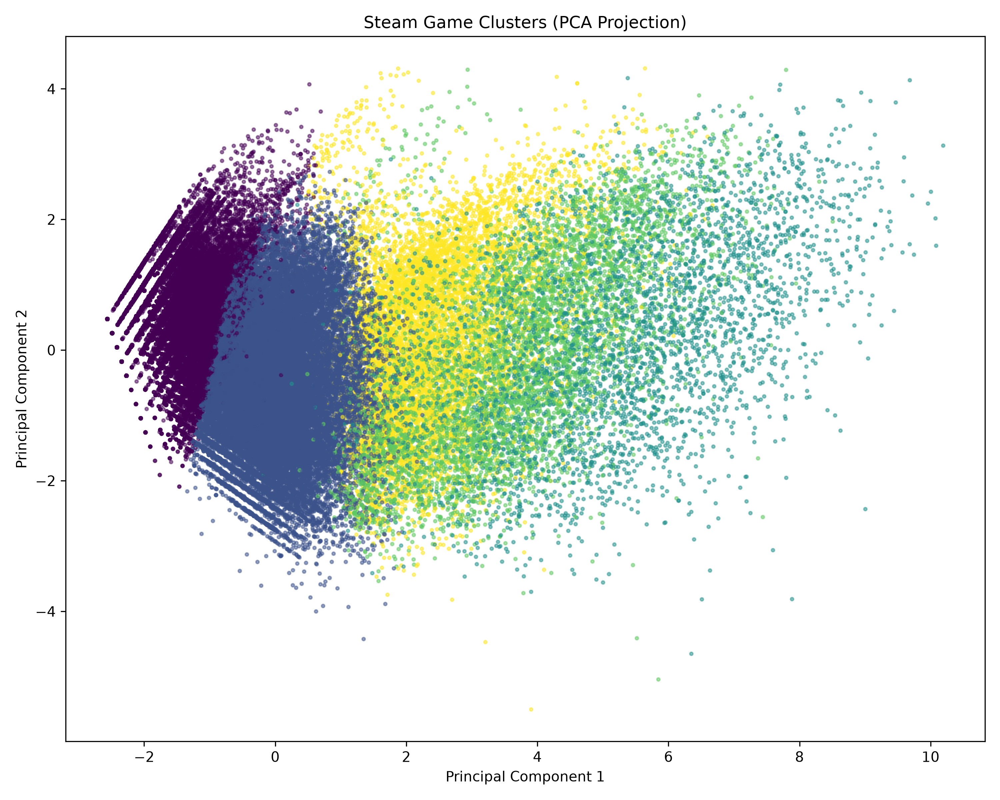
</p>

---

## 📖 Overview

Unlike supervised machine learning, where models predict known outcomes, this project explores **Unsupervised Learning** by automatically discovering natural groups of Steam games without predefined labels.

Using **K-Means Clustering**, the project segments nearly **90,000 Steam games** into meaningful clusters based on characteristics such as:

- 💰 Price
- 👍 Positive Reviews
- 👎 Negative Reviews
- 🎮 Average Playtime
- 🏆 Achievements
- 📦 DLC Count
- ⭐ Recommendations
- 👥 Peak Concurrent Players
- 🎯 Metacritic Score
- 📅 Release Year

The objective is to understand how different types of games naturally organize themselves and generate business insights from these patterns.

---

# 🚀 Business Problem

Steam hosts tens of thousands of games with very different audiences.

Instead of manually labeling games, can Machine Learning automatically discover groups such as:

- Casual Indie Games
- Premium AAA Titles
- Long-Term Engagement Games
- Community Favorites
- Popular Commercial Releases

These insights can support:

- Market research
- Game recommendation systems
- Pricing strategies
- Player segmentation
- Store organization
- Investment decisions

---

# 🧠 Machine Learning Concepts

This project introduces several fundamental concepts in **Unsupervised Machine Learning**.

## Learning Objectives

- Unsupervised Learning
- Clustering
- K-Means
- Euclidean Distance
- Centroids
- Feature Scaling
- StandardScaler
- Log Transformation
- Elbow Method
- Silhouette Score
- PCA (Principal Component Analysis)
- Explained Variance
- Cluster Profiling
- Business Segmentation
- Model Persistence

---

# 📂 Project Workflow

```
Raw Steam Dataset
        │
        ▼
Data Cleaning
        │
        ▼
Feature Selection
        │
        ▼
Log Transformation
        │
        ▼
Feature Scaling
        │
        ▼
Elbow Method
        │
        ▼
Silhouette Analysis
        │
        ▼
K-Means Clustering
        │
        ▼
PCA Visualization
        │
        ▼
Cluster Profiling
        │
        ▼
Business Insights
        │
        ▼
Model Persistence
```

---

# 📊 Dataset

- **Source:** Kaggle Steam Games Dataset
- **Games:** 89,618
- **Features:** 47

Selected features used for clustering:

- Price
- Positive Reviews
- Negative Reviews
- Recommendations
- Average Playtime
- Achievements
- DLC Count
- Peak CCU
- Metacritic Score
- Release Year

---

# 🧹 Data Preparation

Before training the clustering model:

- Removed unnecessary columns
- Selected numerical business features
- Created release year
- Applied log transformation to skewed variables
- Standardized all features using StandardScaler

---

## Feature Distribution Before Scaling

<p align="center">
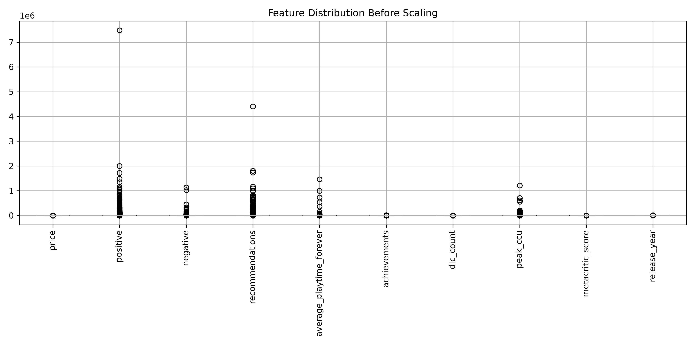
</p>

---

## Feature Distribution After Scaling

<p align="center">
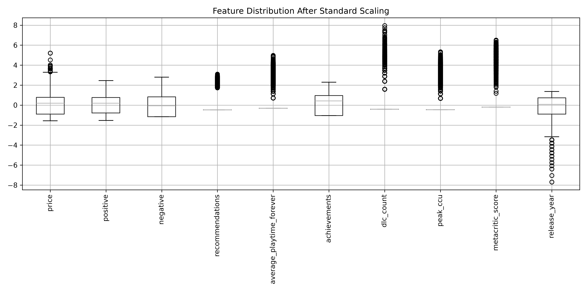
</p>

---

## Log Transformation Example

Before Log Transformation

<p align="center">
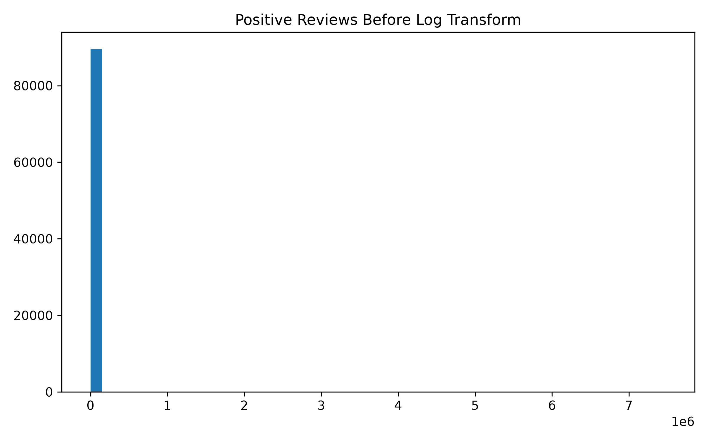
</p>

After Log Transformation

<p align="center">
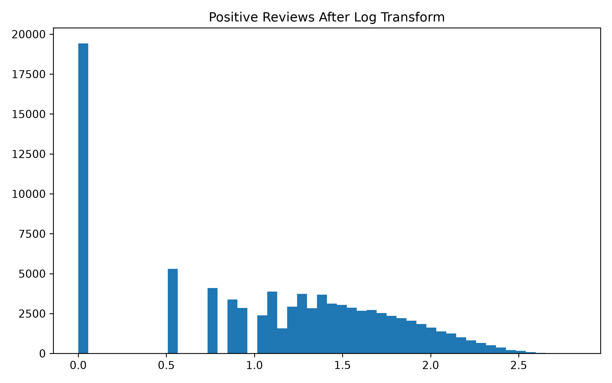
</p>

Log transformation significantly reduced feature skewness, making clustering more effective.

---

# 🤖 K-Means Clustering

The project uses **K-Means** to automatically group similar games.

The algorithm works by:

1. Initializing centroids
2. Assigning each game to the nearest centroid
3. Updating centroid positions
4. Repeating until convergence

---

# 📈 Choosing the Best Number of Clusters

Choosing K randomly is bad practice.

Two evaluation techniques were used.

## Elbow Method

<p align="center">
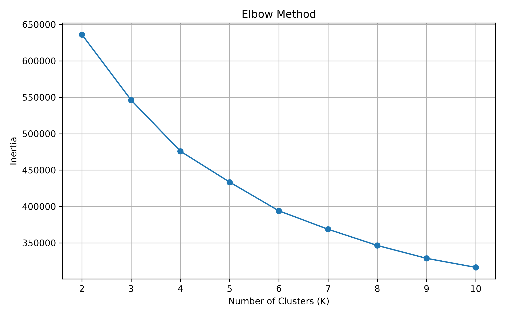
</p>

---

## Silhouette Analysis

<p align="center">
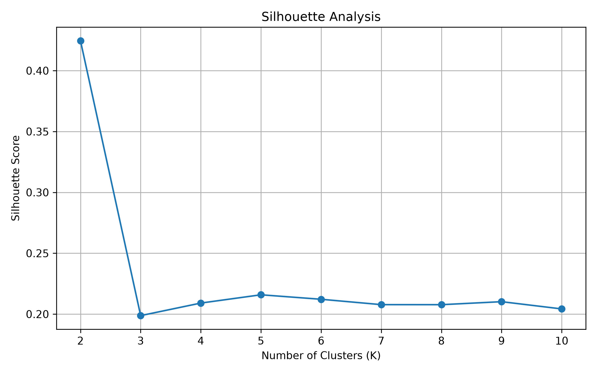
</p>

The combination of both methods suggested that **5 clusters** provides a meaningful segmentation of the Steam marketplace.

---

# 🎨 PCA Visualization

Since humans cannot visualize data in 10 dimensions, PCA reduces the feature space into two principal components while preserving as much information as possible.

<p align="center">

</p>

---

## Explained Variance

<p align="center">
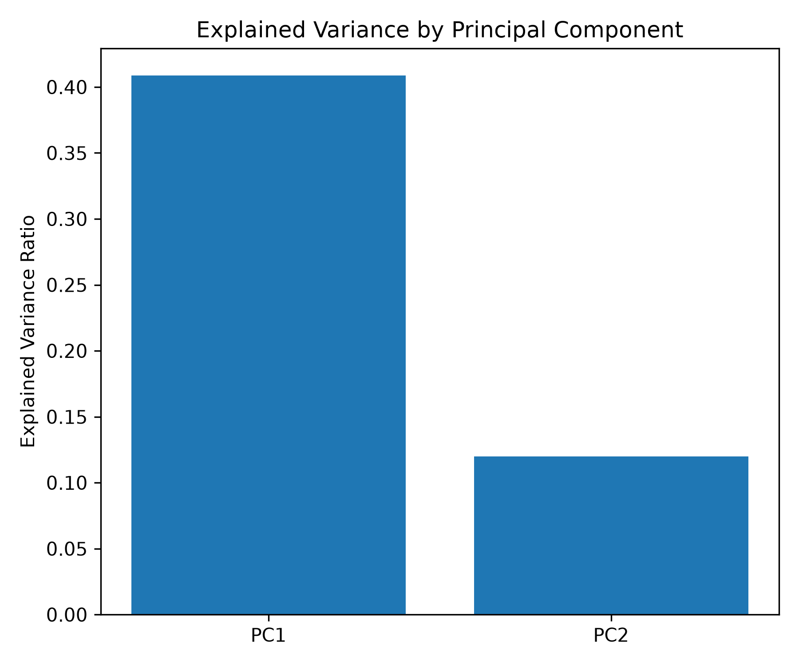
</p>

The first two principal components capture the largest amount of variance in the original dataset, allowing meaningful visualization of the clusters.

---

# 📊 Cluster Distribution

<p align="center">
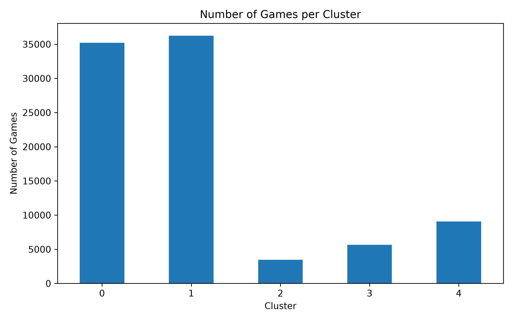
</p>

The clustering algorithm identified five distinct groups with different sizes across the Steam catalog.

---

# 📈 Cluster Analysis

## Average Price by Cluster

<p align="center">
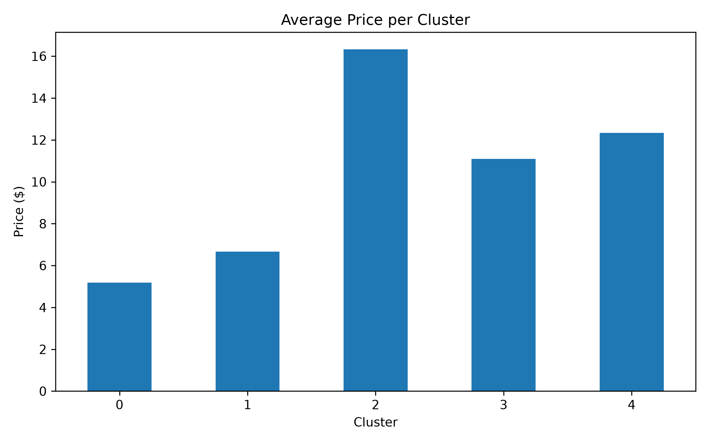
</p>

---

## Average Positive Reviews

<p align="center">
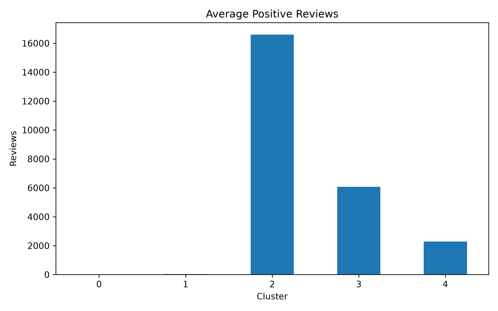
</p>

---

## Average Recommendations

<p align="center">
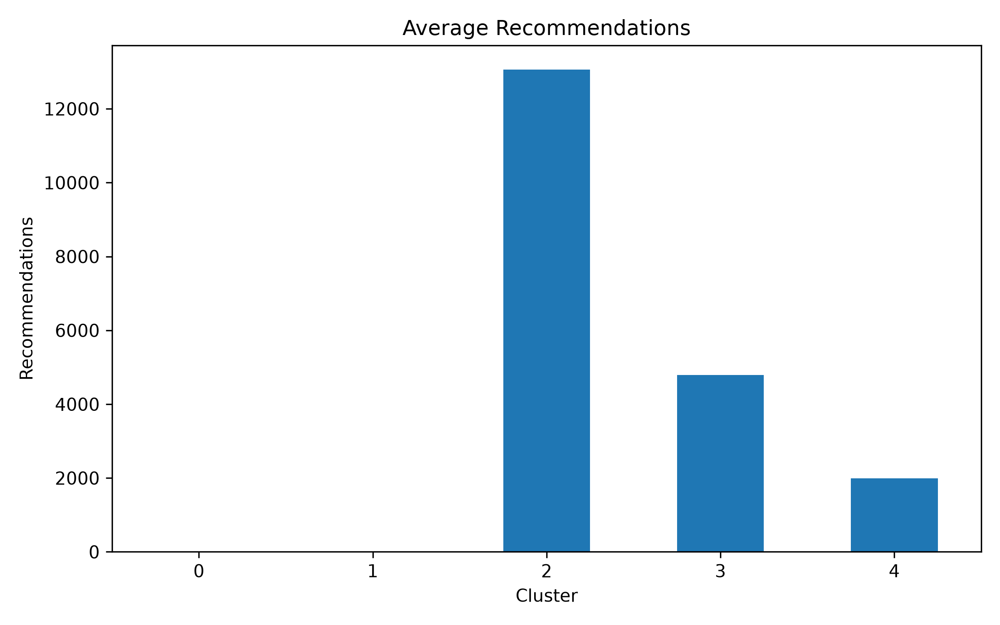
</p>

---

## Average Playtime

<p align="center">
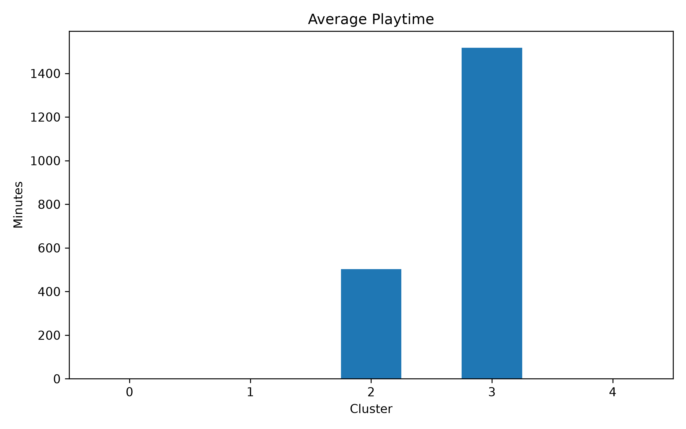
</p>

---

## Cluster Heatmap

<p align="center">
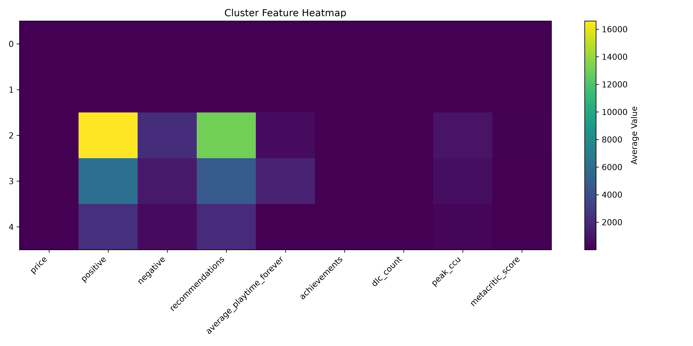
</p>

The heatmap summarizes how each cluster differs across all selected features.

---

# 💡 Business Insights

The clustering algorithm revealed several distinct groups of Steam games.

### 🎮 Casual Games

- Low engagement
- Low playtime
- Small player communities
- Mostly indie titles

### ⭐ Standard Steam Titles

- Average commercial performance
- Moderate player engagement
- Largest portion of the dataset

### 👑 Premium AAA Games

- High review counts
- Strong recommendation rates
- High Metacritic scores
- Significant player activity

### ⏳ Long-Term Engagement Games

- Exceptional average playtime
- Strong retention
- Live-service potential

### 🚀 Popular Commercial Releases

- High player counts
- Strong market performance
- Balanced pricing and engagement

---

# 💾 Saved Models

The trained models are stored for future use.

```
models/

kmeans.pkl
scaler.pkl
pca.pkl
```

This allows new Steam games to be assigned to an existing cluster without retraining the entire model.

---

# 🛠 Technologies Used

- Python
- Pandas
- NumPy
- Matplotlib
- Plotly
- Scikit-Learn
- Joblib
- Jupyter Notebook

---

# 📁 Project Structure

```
steam-player-segmentation/
│
├── data/
│   └── games.csv
│
├── models/
│   ├── kmeans.pkl
│   ├── scaler.pkl
│   └── pca.pkl
│
├── notebooks/
│   └── clustering.ipynb
│
├── screenshots/
│
├── requirements.txt
│
└── README.md
```

---

# 🔮 Future Improvements

Potential extensions include:

- DBSCAN
- Hierarchical Clustering
- Gaussian Mixture Models
- t-SNE
- UMAP
- Automatic Cluster Naming using LLMs
- Recommendation Systems
- Interactive Streamlit Dashboard

---

# 📚 Key Takeaways

This project demonstrates the complete workflow of an **Unsupervised Machine Learning** pipeline:

- Data Preparation
- Feature Engineering
- Feature Scaling
- K-Means Clustering
- Cluster Evaluation
- PCA Visualization
- Business Interpretation
- Model Persistence

Rather than predicting outcomes, the model uncovers hidden structures in the Steam ecosystem, providing valuable insights for analytics, recommendation systems, and business decision-making.