# 🎮 Video Game Sales Prediction with Deep Learning

<p align="center">
  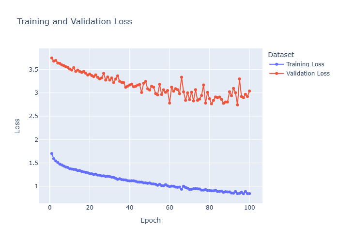
</p>

<p align="center">
  <strong>End-to-End Deep Learning Regression Project using PyTorch</strong><br>
  Building, training, and evaluating a Multi-Layer Perceptron (MLP) to predict global video game sales from structured game metadata.
</p>

---

# 📖 Overview

This project marks the transition from **Classical Machine Learning** to **Deep Learning** by replacing traditional regression models with a fully connected neural network built entirely in **PyTorch**.

The objective is to predict the **Global Sales** of video games using metadata such as platform, genre, publisher, critic scores, user scores, release year, and more.

Unlike previous machine learning projects, every stage of the deep learning pipeline was implemented manually, including:

- Data preprocessing
- Tensor conversion
- Mini-batch loading
- Neural network architecture
- Training loop
- Backpropagation
- Validation
- Model checkpointing
- Performance evaluation
- Visualization

---

# 🎯 Objectives

- Fundamentals of Deep Learning
- Build a Multi-Layer Perceptron (MLP) from scratch
- Understand forward and backward propagation
- Train neural networks using PyTorch
- Compare Deep Learning against Classical Machine Learning
- Produce a professional AI project with reproducible results

---

# 🧠 Neural Network Architecture

The model consists of a simple fully connected neural network designed for regression.

```
Input Features (10)
        │
        ▼
Linear (10 → 64)
        │
      ReLU
        │
        ▼
Linear (64 → 32)
        │
      ReLU
        │
        ▼
Linear (32 → 1)
        │
        ▼
Predicted Global Sales
```

### Model Summary

| Layer | Neurons |
|--------|---------:|
| Input | 10 |
| Hidden Layer 1 | 64 |
| Hidden Layer 2 | 32 |
| Output | 1 |

---

# 🛠 Tech Stack

- Python
- PyTorch
- NumPy
- Pandas
- Plotly
- Scikit-learn
- Jupyter Notebook

---

# 📂 Project Structure

```
11-video-game-sales-prediction/

│
├── data/
│
├── models/
│   └── video_game_sales_mlp.pth
│
├── notebooks/
│   └── deep_learning_pipeline.ipynb
│
├── outputs/
│   ├── figures/
│   ├── metrics/
│   └── predictions/
│
├── README.md
└── requirements.txt
```

---

# ⚙️ Deep Learning Pipeline

```
Game Sales Dataset
        │
        ▼
Data Cleaning
        │
        ▼
Feature Encoding
        │
        ▼
Train/Test Split
        │
        ▼
Feature Scaling
        │
        ▼
PyTorch Tensors
        │
        ▼
TensorDataset
        │
        ▼
DataLoader
        │
        ▼
Multi-Layer Perceptron
        │
        ▼
Training & Validation
        │
        ▼
Model Evaluation
```

---

# 📊 Dataset Overview

## Dataset & DataLoader Summary

<p align="center">
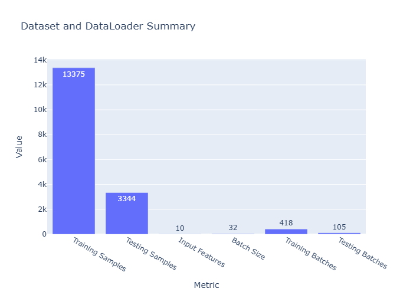
</p>

The dataset was transformed into PyTorch tensors and loaded using `TensorDataset` and `DataLoader`, enabling efficient mini-batch training.

---

# 🧠 Model Architecture

<p align="center">
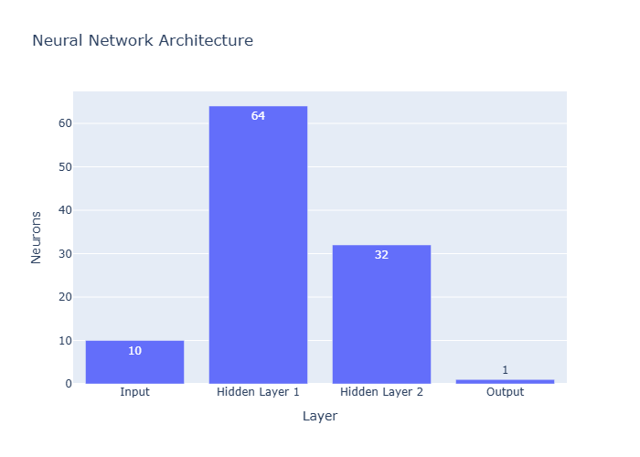
</p>

The model contains two hidden layers with ReLU activation functions, providing enough capacity to learn non-linear relationships within the dataset.

---

# 📈 Parameter Distribution

<p align="center">
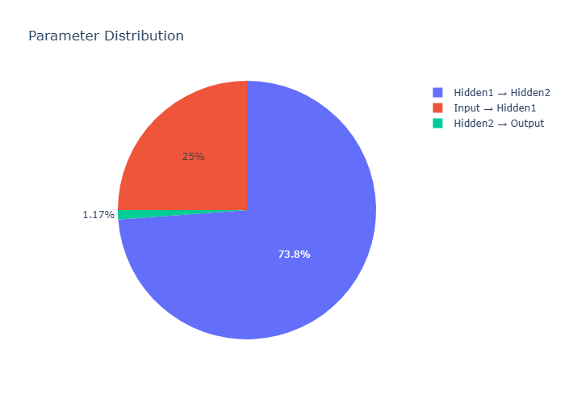
</p>

Total Trainable Parameters:

**2,817**

---

# ⚙️ Training Configuration

<p align="center">
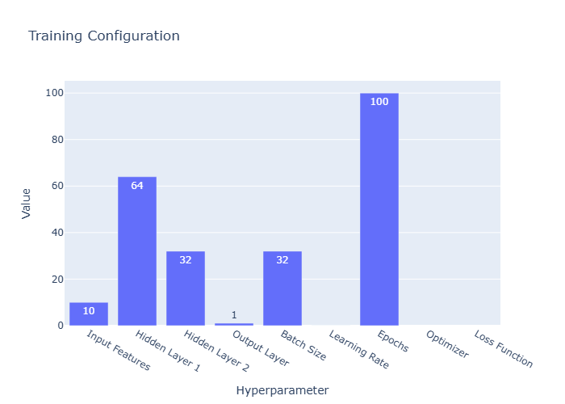
</p>

| Hyperparameter | Value |
|---------------|------:|
| Input Features | 10 |
| Hidden Layer 1 | 64 |
| Hidden Layer 2 | 32 |
| Batch Size | 32 |
| Learning Rate | 0.001 |
| Epochs | 100 |
| Optimizer | Adam |
| Loss Function | MSELoss |

---

# 📉 Training Progress

## Training & Validation Loss

<p align="center">

</p>

The model steadily reduced the training loss throughout the learning process while validation loss decreased more gradually, indicating successful learning with mild overfitting toward later epochs.

---

## Training Summary

<p align="center">
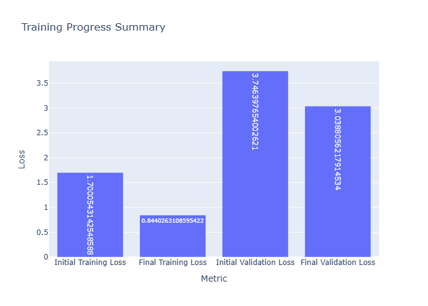
</p>

---

# 📊 Model Evaluation

## Regression Metrics

<p align="center">
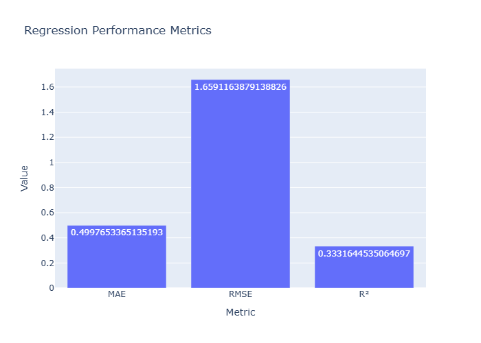
</p>

| Metric | Score |
|--------|-------:|
| MAE | **0.500** |
| RMSE | **1.659** |
| R² Score | **0.333** |

---

# 🎯 Prediction Performance

## Actual vs Predicted Values

<p align="center">
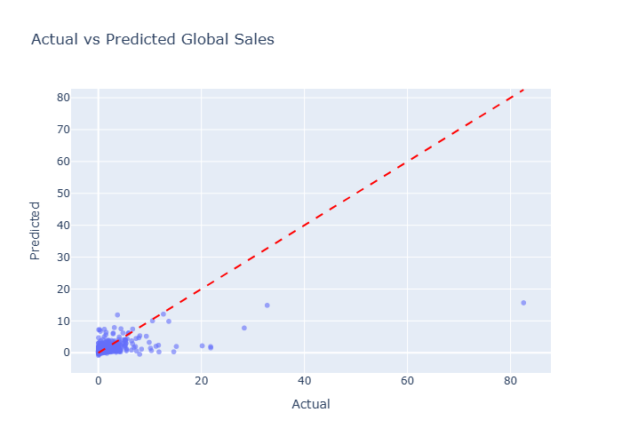
</p>

Most predictions closely follow the overall trend of the target values, while the model underestimates a small number of blockbuster games with exceptionally high sales.

---

## Residual Distribution

<p align="center">
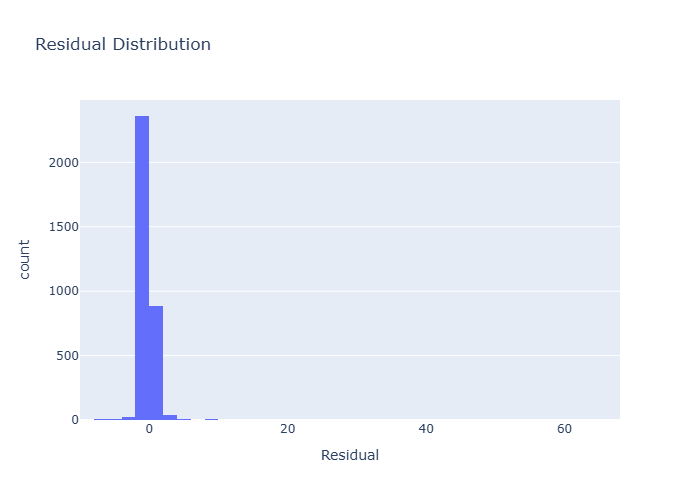
</p>

Residuals are centered around zero, indicating that prediction errors remain relatively balanced across the dataset.

---

## Residual Analysis

<p align="center">
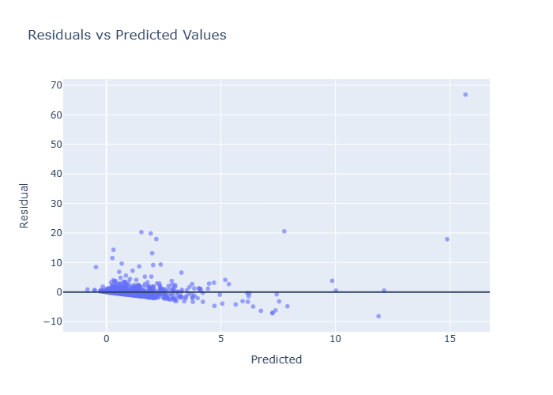
</p>

Residual analysis reveals that the largest errors occur primarily for extremely successful games, which represent rare outliers within the dataset.

---

# 📈 Comparison with Classical Machine Learning

This project compares Deep Learning against models developed during Week 2.

## Mean Absolute Error

<p align="center">
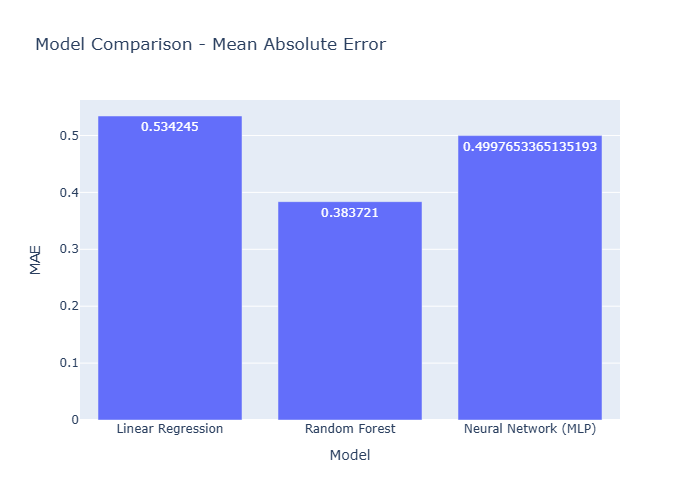
</p>

---

## Root Mean Squared Error

<p align="center">
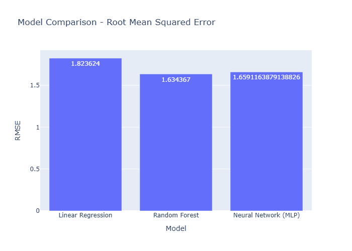
</p>

---

## R² Score

<p align="center">
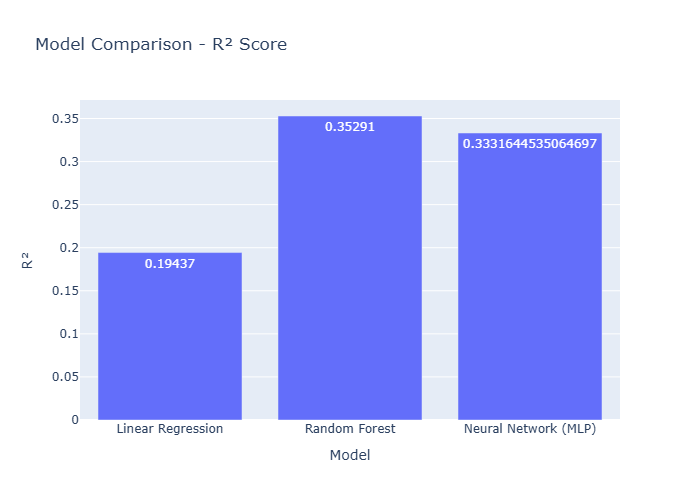
</p>

| Model | MAE | RMSE | R² |
|------|------:|------:|------:|
| Linear Regression | 0.534 | 1.824 | 0.194 |
| Random Forest | **0.384** | **1.634** | **0.353** |
| **Deep Learning (MLP)** | **0.500** | **1.659** | **0.333** |

The neural network significantly outperformed Linear Regression and achieved performance close to Random Forest. This demonstrates that while neural networks can successfully model structured tabular data, tree-based algorithms often remain highly competitive for this type of problem.

---

# 📁 Generated Outputs

## Figures

- Dataset Summary
- Neural Network Architecture
- Parameter Distribution
- Training Configuration
- Training Summary
- Loss Curve
- Regression Metrics
- Actual vs Predicted
- Residual Distribution
- Residual Analysis
- Model Comparison (MAE)
- Model Comparison (RMSE)
- Model Comparison (R²)

## Metrics

- Hyperparameters
- Training History
- Best Validation Results
- Evaluation Metrics

## Predictions

- Complete Prediction Results (CSV)

---

# 🎓 Deep Learning Concepts Covered

- Neural Networks
- Perceptrons
- Multi-Layer Perceptrons (MLP)
- Forward Propagation
- Backpropagation
- Gradient Descent
- Adam Optimizer
- Mean Squared Error Loss
- ReLU Activation
- Mini-Batch Training
- TensorDataset
- DataLoader
- Model Checkpointing
- Validation Loop
- Model Evaluation
- Regression Analysis

---

# 🚀 Key Takeaways

- Successfully built a complete Deep Learning regression pipeline using PyTorch.
- Implemented every stage of the neural network training process from scratch.
- Learned the fundamentals of tensors, data loaders, training loops, optimization, and backpropagation.
- Demonstrated that Deep Learning can effectively model structured datasets while highlighting the strengths of traditional tree-based models on tabular data.
- Produced a reproducible project with professional documentation, saved metrics, trained models, and interactive visualizations suitable for an AI engineering portfolio.