# 🧠 Image Classification with Convolutional Neural Networks (CNNs)

<p align="center">
  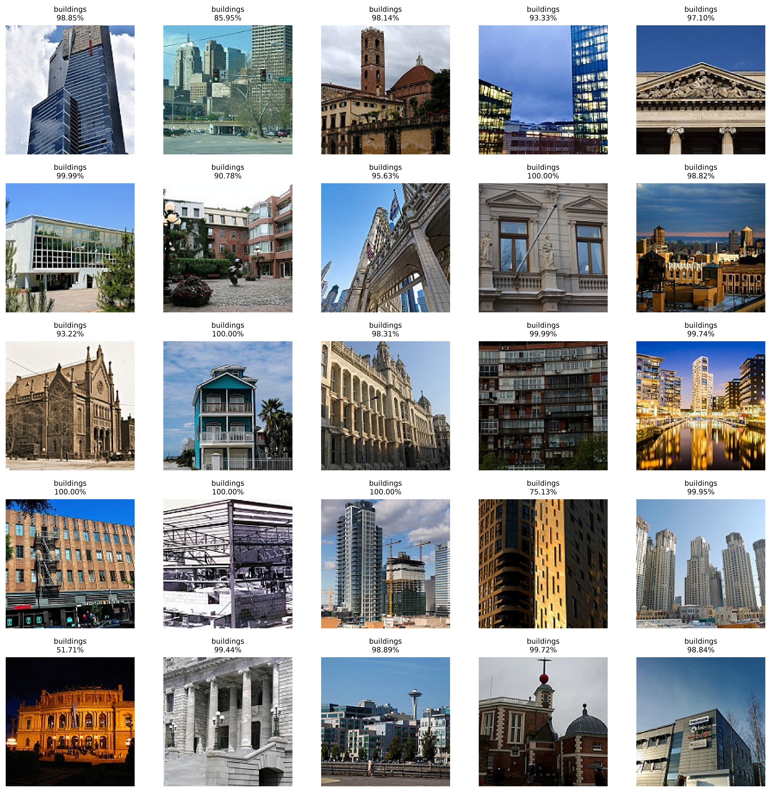
</p>

<p align="center">


</p>

---

# 📖 Project Overview

This project demonstrates an end-to-end Computer Vision pipeline using **PyTorch** and **Convolutional Neural Networks (CNNs)** to classify natural scene images into six different categories.

The objective is to build a complete deep learning workflow covering:

- Image preprocessing
- Data augmentation
- CNN architecture design
- Model training
- Performance evaluation
- Explainable AI
- Model prediction visualization

The project was developed as **Project 12** of my AI Engineering Bootcamp, introducing modern Computer Vision with deep learning.

---

# 🎯 Business Problem

Automatic image classification has applications across numerous industries, including:

- Medical diagnosis
- Manufacturing quality inspection
- Wildlife monitoring
- Retail product recognition
- Security surveillance
- Autonomous vehicles

The goal is to train a CNN capable of recognizing the category of an unseen image.

---

# 📂 Dataset

**Intel Image Classification Dataset**

Six scene categories:

- 🏢 Buildings
- 🌲 Forest
- ❄ Glacier
- ⛰ Mountain
- 🌊 Sea
- 🛣 Street

---

## Dataset Overview

<p align="center">
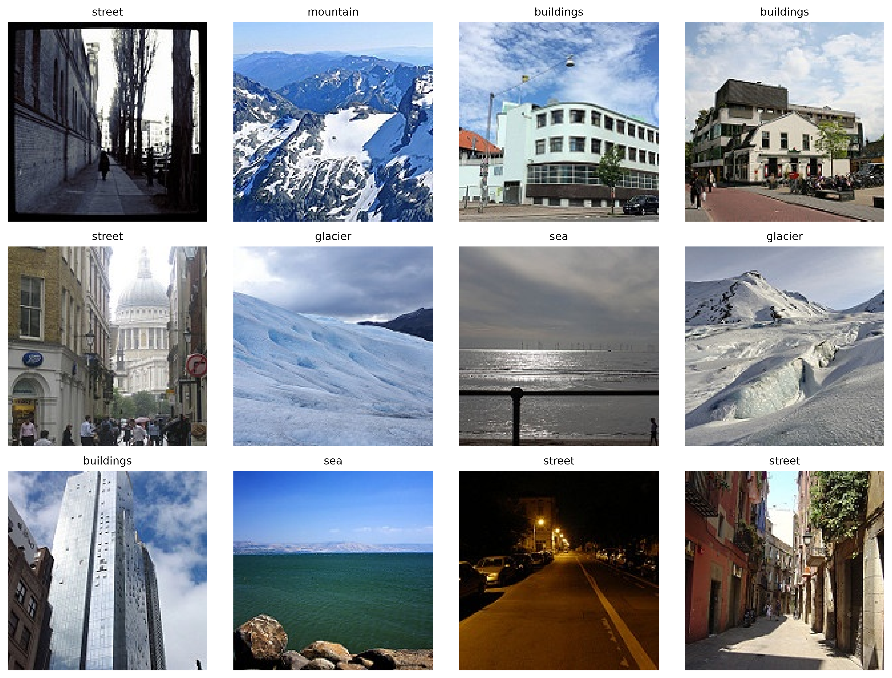
</p>

---

## Dataset Distribution

<p align="center">
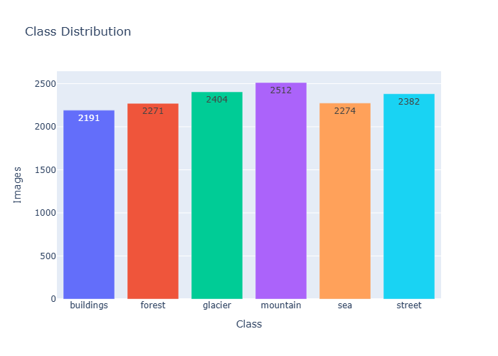
</p>

---

## Train / Validation / Test Split

<p align="center">
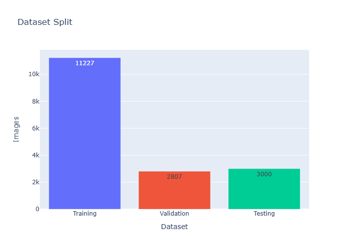
</p>

---

# 📸 Data Augmentation

To improve generalization, multiple augmentation techniques were applied:

- Resize
- Random Horizontal Flip
- Random Rotation
- Random Resized Crop
- Color Jitter
- Image Normalization

### Augmentation Examples

<p align="center">
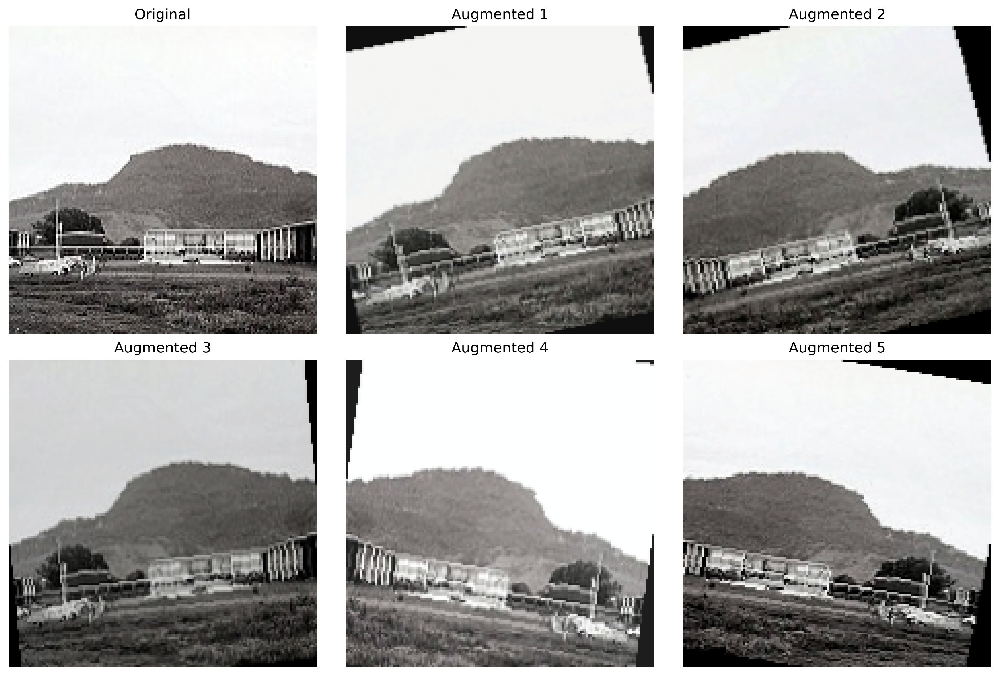
</p>

---

# 🖼 Understanding Images

CNNs receive images as tensors rather than traditional RGB pictures.

The following visualization illustrates the RGB channels used as model input.

<p align="center">
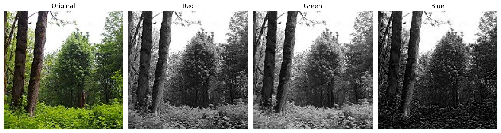
</p>

---

# 🏗 CNN Architecture

The model was implemented entirely from scratch using PyTorch.

```
Input (3 × 150 × 150)
        │
Conv2D (32)
BatchNorm
ReLU
MaxPooling

        │

Conv2D (64)
BatchNorm
ReLU
MaxPooling

        │

Conv2D (128)
BatchNorm
ReLU
MaxPooling

        │

Flatten

        │

Dropout

        │

Linear (256)

        │

ReLU

        │

Dropout

        │

Linear (6)

        │

Softmax

        │

Predicted Class
```

---

## CNN Parameters

| Metric | Value |
|---------|-------:|
| Total Parameters | 10,712,326 |
| Trainable Parameters | 10,712,326 |

The architecture combines:

- Convolutional Layers
- Batch Normalization
- ReLU Activation
- Max Pooling
- Dropout Regularization
- Fully Connected Layers

---

# ⚙ Training Configuration

```
outputs/metrics/training_configuration.csv
```

---

# 📈 Training Progress

## Training & Validation Loss

<p align="center">
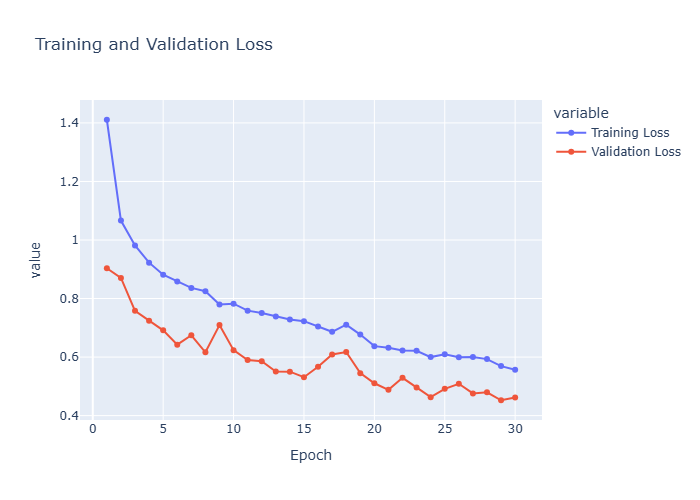
</p>

---

## Training & Validation Accuracy

<p align="center">
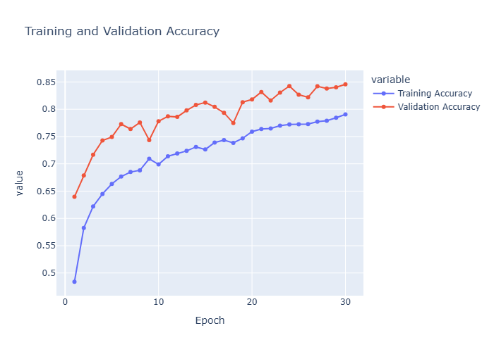
</p>

---

## Learning Rate Scheduling

<p align="center">
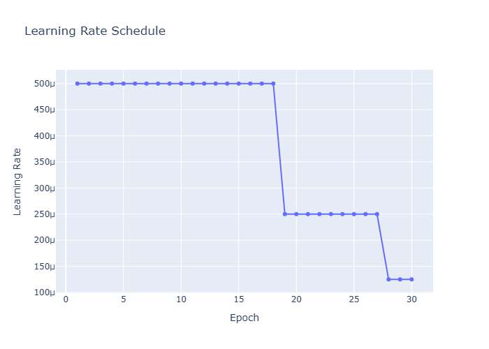
</p>

The project utilizes:

- Adam Optimizer
- CrossEntropyLoss
- ReduceLROnPlateau Scheduler
- Early Stopping

---

# 📊 Model Performance

Final Test Accuracy:

# **85.4%**

Evaluation metrics were exported to:

```
outputs/metrics/test_metrics.csv
```

---

## Classification Report

```
outputs/metrics/classification_report.csv
```

Highlights:

| Metric | Score |
|---------|-------:|
| Accuracy | 85.40% |
| Precision | 85.64% |
| Recall | 85.40% |
| F1 Score | 85.32% |

---

## Confusion Matrix

<p align="center">
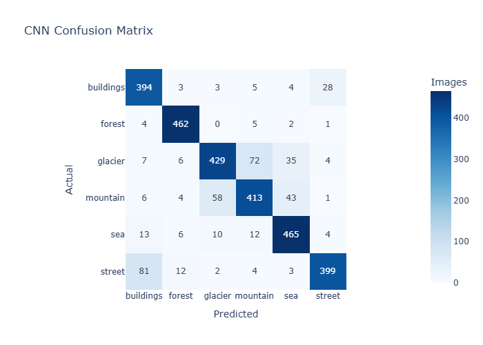
</p>

The confusion matrix reveals that the largest confusion occurs between **Glacier** and **Mountain**, which share similar visual characteristics.

---

# 🔮 Predictions

## Correct Predictions

<p align="center">

</p>

---

## Misclassified Images

<p align="center">
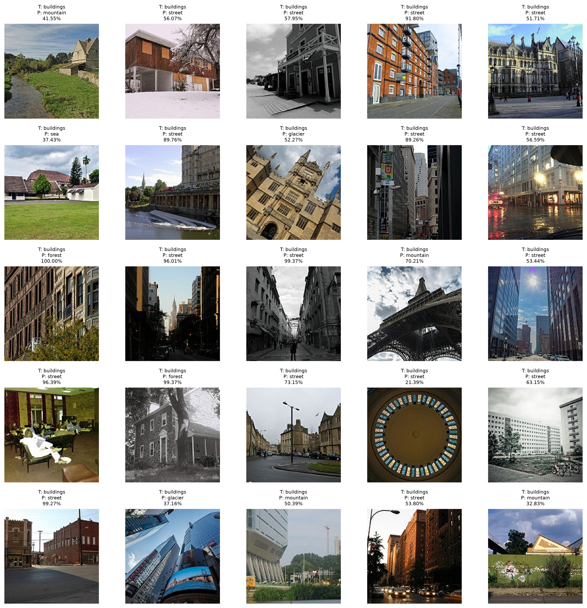
</p>

These examples help identify challenging samples where visually similar classes are confused.

---

## Prediction Confidence

<p align="center">
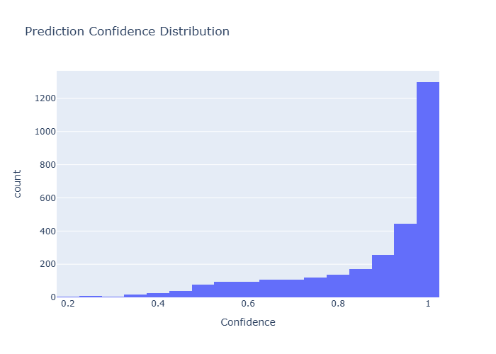
</p>

Prediction results are also exported as:

```
outputs/predictions/predictions.csv
```

---

# 🧠 Explainable AI

Understanding *why* a CNN makes a prediction is as important as achieving high accuracy.

This project includes multiple explainability techniques.

---

## Learned Filters

<p align="center">
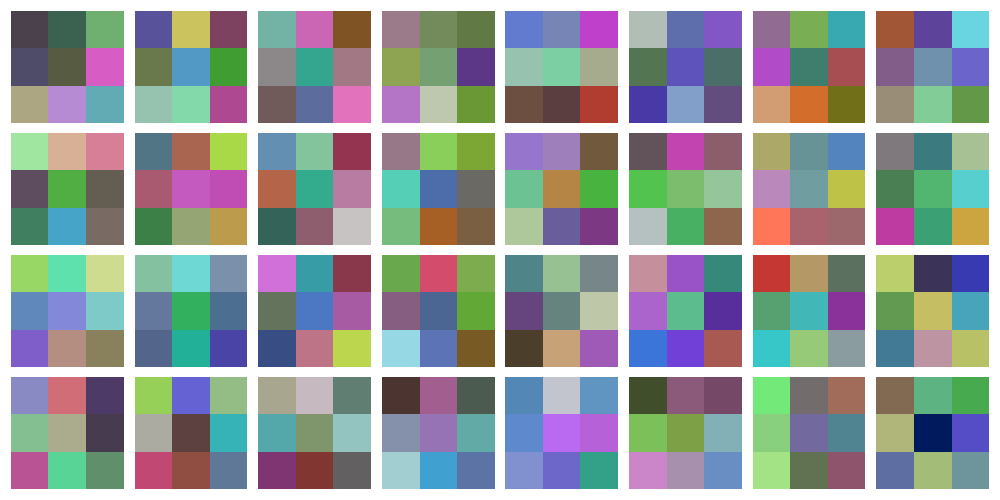
</p>

The first convolutional layer learns basic visual patterns such as edges, textures and color transitions.

---

## Feature Maps

<p align="center">
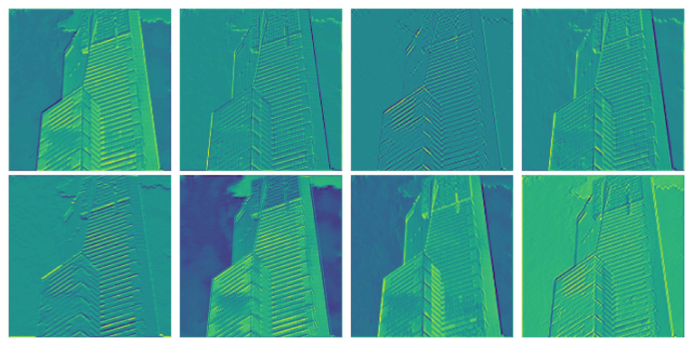
</p>

Feature maps illustrate how deeper convolutional layers progressively capture higher-level semantic information.

---

## Grad-CAM

<p align="center">
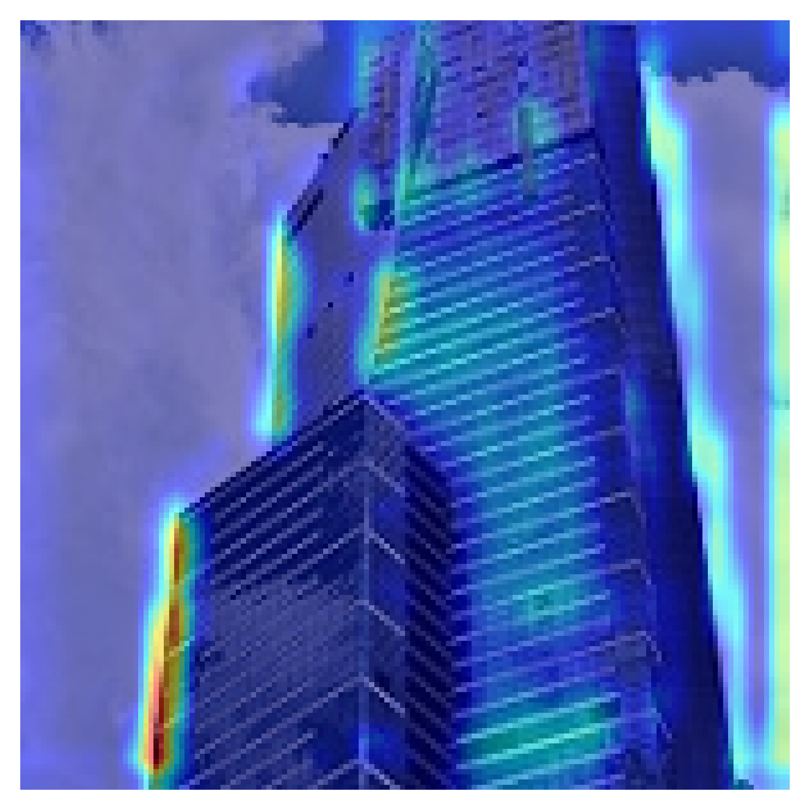
</p>

Grad-CAM highlights the regions of an image that most influenced the CNN's prediction, providing interpretable visual explanations.

---

# 📁 Project Structure

```
12-cnn-deep-learning/

│
├── data/
│
├── models/
│
├── notebooks/
│
├── outputs/
│   ├── figures/
│   ├── explainability/
│   ├── metrics/
│   └── predictions/
│
├── README.md
├── requirements.txt
└── .gitignore
```

---

# 🛠 Technologies Used

- Python
- PyTorch
- Torchvision
- NumPy
- Pandas
- Plotly
- Matplotlib
- Scikit-learn

---

# 🧠 Deep Learning Concepts Covered

This project introduces and applies:

- Computer Vision
- Image Tensors
- RGB Channels
- Convolutional Neural Networks
- Convolution Layers
- Kernels
- Filters
- Feature Maps
- Padding
- Stride
- Max Pooling
- Batch Normalization
- Dropout
- Data Augmentation
- CrossEntropyLoss
- Softmax
- Adam Optimizer
- Learning Rate Scheduling
- Early Stopping
- Multiclass Classification
- Precision
- Recall
- F1 Score
- Confusion Matrix
- Explainable AI
- Feature Visualization
- Grad-CAM

---

# 🚀 Results

✔ Built a CNN entirely from scratch using PyTorch.

✔ Achieved **85.4%** test accuracy on a six-class real-world image classification dataset.

✔ Implemented a complete deep learning workflow, including preprocessing, augmentation, training, evaluation, visualization, and explainability.

✔ Produced a fully documented AI project suitable for portfolio presentation and future transfer learning experiments.

---

# 👨‍💻 Author

**Sami Mahdadi**

AI Engineer • Machine Learning • Deep Learning • Computer Vision • Data Science • Game Development