# 🧠 Steam Review Sentiment Analysis with Deep Learning (PyTorch)

<p align="center">
    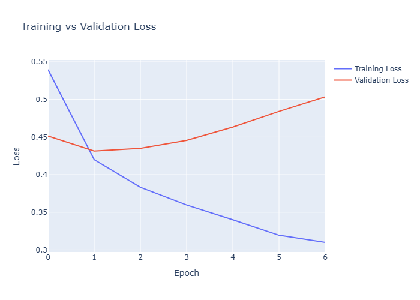
</p>

## 📌 Overview

This project builds an end-to-end **Natural Language Processing (NLP)** pipeline capable of automatically classifying Steam reviews as **Positive** or **Negative** using **PyTorch**.

Unlike traditional machine learning approaches that rely on handcrafted features, this project learns semantic representations of words through an **Embedding Layer** and performs sentiment classification using a fully connected neural network.

The project covers every stage of a modern NLP workflow, including text preprocessing, vocabulary construction, sequence encoding, neural network training, evaluation, explainability, and prediction confidence analysis.

---

# 📖 Business Problem

Steam hosts millions of user reviews across thousands of games.

Manually reading every review is impossible.

Automatically understanding player sentiment helps developers:

- Measure customer satisfaction
- Monitor product quality
- Detect negative trends
- Analyze player feedback
- Improve recommendation systems
- Support review moderation

This project demonstrates how Deep Learning can automatically classify user reviews into positive or negative sentiment.

---

# 🎯 Objectives

- Learn Natural Language Processing fundamentals
- Build a vocabulary from raw text
- Encode text into numerical sequences
- Train a neural network using PyTorch
- Understand word embeddings
- Evaluate a binary classification model
- Visualize learned representations
- Explain model predictions

---

# 📂 Project Structure

```text
13-nlp-sentiment-analysis/

│

├── data/

├── models/
│      sentiment_model.pth
│      vocabulary.pkl

├── notebooks/
│      nlp.ipynb

├── outputs/
│      figures/
│      metrics/
│      explainability/
│      predictions/

├── README.md
├── requirements.txt
└── .gitignore
```

---

# 📊 Dataset

The project uses the **Steam Reviews Dataset** from Kaggle.

After preprocessing, the project trains on a balanced subset containing:

| Property | Value |
|-----------|------:|
| Training Samples | 64,000 |
| Validation Samples | 16,000 |
| Testing Samples | 20,000 |
| Vocabulary Size | 20,000 |
| Maximum Sequence Length | 100 |

---

# 📝 Dataset Distribution

<p align="center">
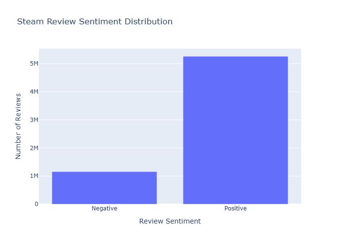
</p>

The training dataset is balanced between positive and negative reviews, preventing bias toward one sentiment class.

---

# 🧹 Text Preprocessing

Every review passes through a complete preprocessing pipeline.

Steps include:

- Lowercasing
- Removing HTML tags
- Removing URLs
- Removing punctuation
- Removing emojis
- Removing stopwords
- Tokenization
- Vocabulary encoding
- Sequence padding

Example preprocessing results are saved inside:

```
outputs/metrics/text_cleaning_examples.csv
```

---

# 📚 Word Statistics

The vocabulary is built from the most frequent words in the training corpus.

## Word Frequency

<p align="center">
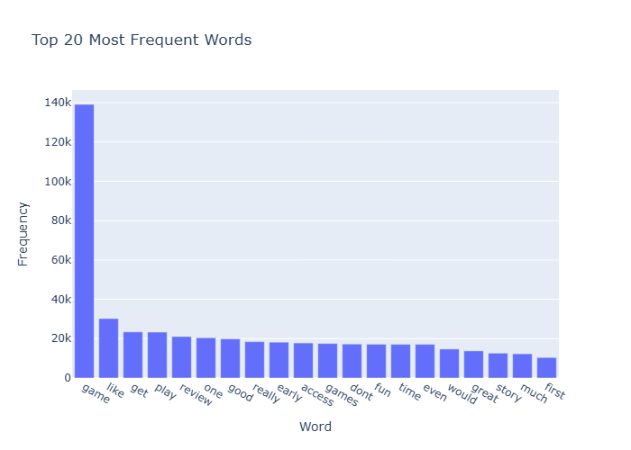
</p>

---

## Word Cloud

<p align="center">
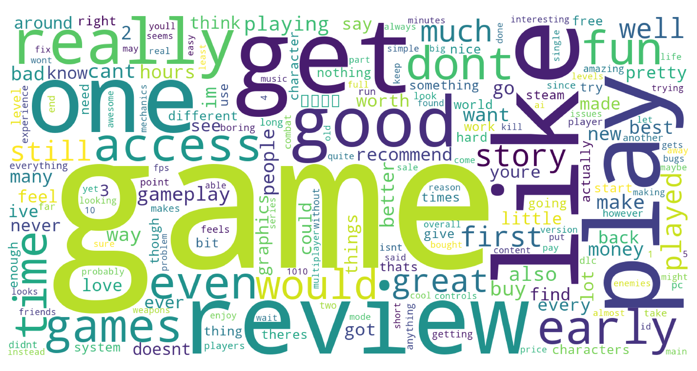
</p>

The word cloud highlights the most frequently occurring terms after text cleaning.

---

# 📏 Review Length Analysis

Understanding sequence length is important before choosing a padding size.

## Review Length Distribution

<p align="center">
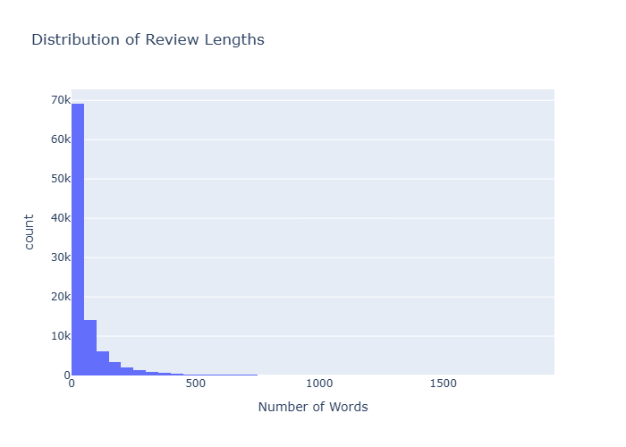
</p>

## Review Length Scatter

<p align="center">
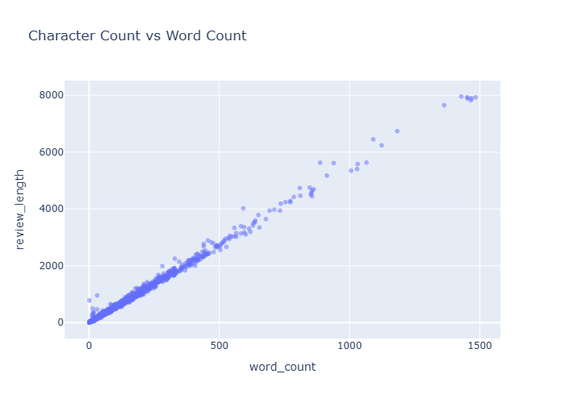
</p>

## Token Count Distribution

<p align="center">
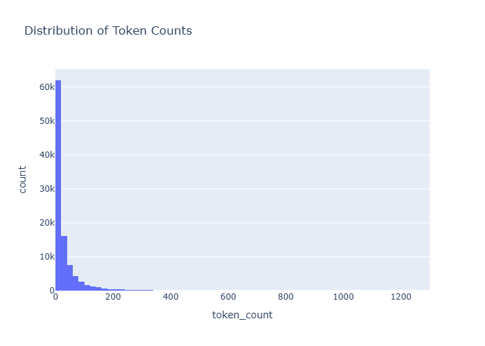
</p>

These visualizations helped determine the maximum sequence length used during training.

---

# 🧠 Model Architecture

The sentiment classifier follows the architecture below:

```
Input Review

        │

        ▼

Embedding Layer

        │

Average Pooling

        │

Linear Layer

        │

ReLU

        │

Dropout

        │

Linear Layer

        │

Sigmoid

        │

Positive / Negative
```

The model learns semantic representations of words through an embedding layer before performing binary sentiment classification.

---

# ⚙️ Training Configuration

| Hyperparameter | Value |
|----------------|------:|
| Embedding Dimension | 128 |
| Hidden Dimension | 128 |
| Batch Size | 64 |
| Learning Rate | 0.001 |
| Epochs | 20 |
| Optimizer | Adam |
| Loss Function | BCEWithLogitsLoss |
| Scheduler | ReduceLROnPlateau |
| Early Stopping | Enabled |

Complete configuration:

```
outputs/metrics/training_configuration.csv
```

---

# 📉 Training Performance

## Training Loss

<p align="center">

</p>

The loss consistently decreases throughout training, indicating stable optimization.

---

## Validation Accuracy

<p align="center">
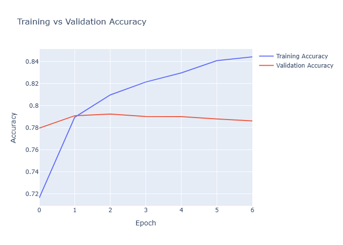
</p>

Validation accuracy stabilizes around **79%**, demonstrating good generalization.

---

## Learning Rate Schedule

<p align="center">
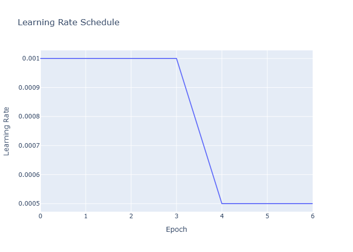
</p>

The learning rate scheduler automatically reduced the learning rate when validation performance plateaued.

---

# 📈 Model Evaluation

## Confusion Matrix

<p align="center">
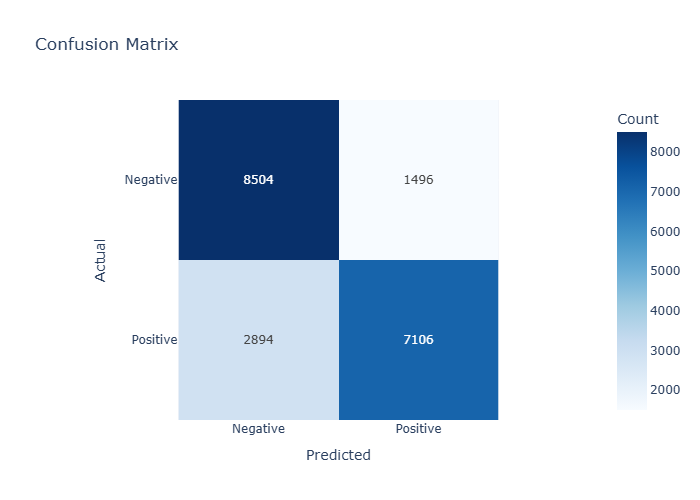
</p>

---

## ROC Curve

<p align="center">
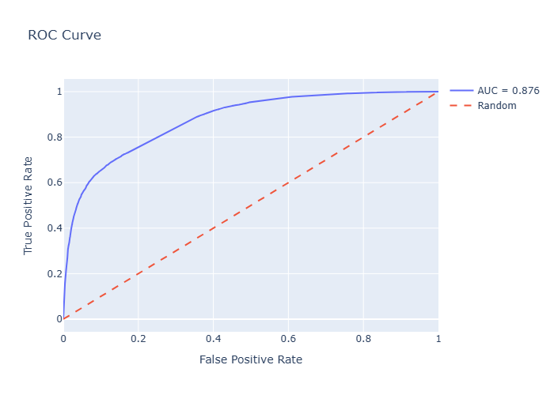
</p>

The ROC curve demonstrates the model's ability to distinguish between positive and negative reviews across different thresholds.

---

# 📊 Classification Performance

Final evaluation metrics are stored in:

```
outputs/metrics/classification_report.csv
```

Including:

- Accuracy
- Precision
- Recall
- F1-score
- Macro Average
- Weighted Average

---

# 🎯 Prediction Confidence

<p align="center">
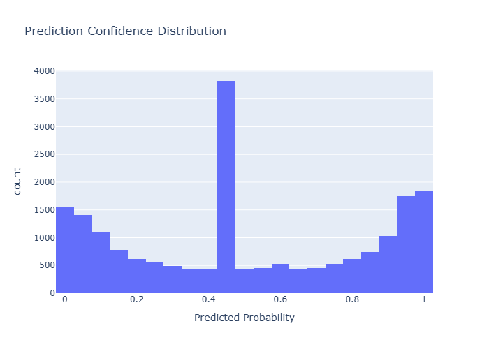
</p>

Confidence scores show how certain the model is when classifying individual reviews.

---

# 🔍 Explainability

One of the goals of this project is understanding **why** the model makes its predictions.

---

## Learned Word Embeddings

<p align="center">
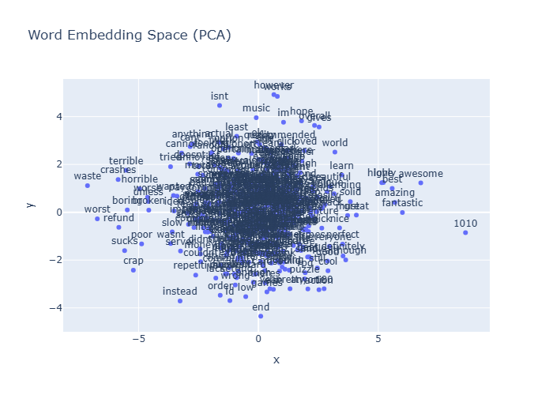
</p>

Word embeddings project high-dimensional semantic representations into two dimensions using PCA.

Words with similar meanings naturally cluster together, demonstrating that the neural network has learned meaningful relationships between words.

---

## Most Influential Tokens

<p align="center">
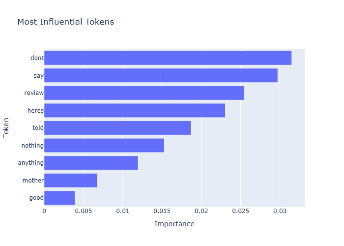
</p>

For each prediction, token importance is estimated by measuring the change in prediction confidence when individual words are removed.

This provides local explainability by identifying which words contributed most to the final sentiment prediction.

---

# 📁 Generated Outputs

## Figures

- Dataset Distribution
- Word Frequency
- Word Cloud
- Review Length Distribution
- Review Length Scatter
- Token Count Distribution
- Training Loss
- Validation Accuracy
- Learning Rate Schedule
- Confusion Matrix
- ROC Curve
- Prediction Confidence
- Embedding Visualization

---

## Explainability

- Influential Tokens

---

## Metrics

- Dataset Summary
- Training Configuration
- Training History
- Training Summary
- Classification Report
- Evaluation Metrics
- Model Parameters
- Review Length Statistics
- Text Cleaning Examples
- Text Transformation Pipeline

---

## Predictions

- predictions.csv
- misclassified_reviews.csv

---

# 🛠 Technologies Used

- Python
- PyTorch
- Torchvision
- Pandas
- NumPy
- Scikit-learn
- NLTK
- Plotly
- Matplotlib
- WordCloud
- Jupyter Notebook

---

# 🧠 Deep Learning Concepts Covered

- Natural Language Processing
- Text Cleaning
- Tokenization
- Vocabulary Construction
- Sequence Encoding
- Padding & Truncation
- Word Embeddings
- Dense Neural Networks
- Binary Sentiment Classification
- BCEWithLogitsLoss
- Adam Optimizer
- Learning Rate Scheduling
- Early Stopping
- ROC Analysis
- Confusion Matrix
- Explainable AI
- Embedding Visualization
- Prediction Confidence Analysis

---

# ✅ Results

The final model successfully learned meaningful semantic representations of Steam reviews and achieved strong binary sentiment classification performance while remaining lightweight and interpretable.

The project demonstrates a complete deep learning workflow for Natural Language Processing, from raw text preprocessing to explainable predictions using PyTorch.