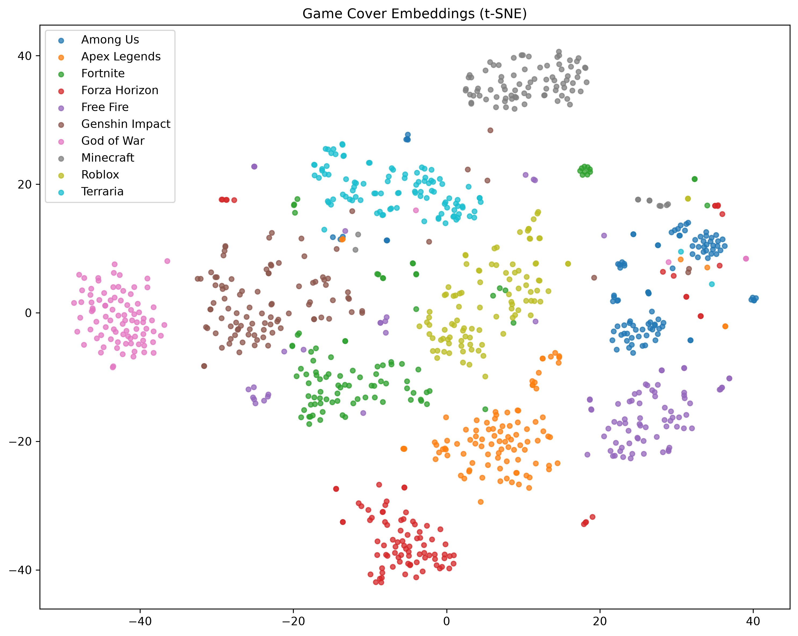
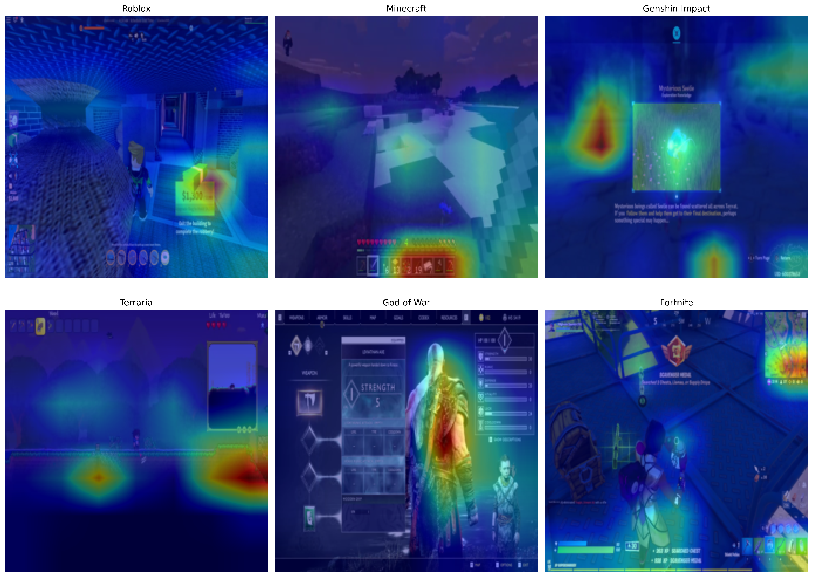
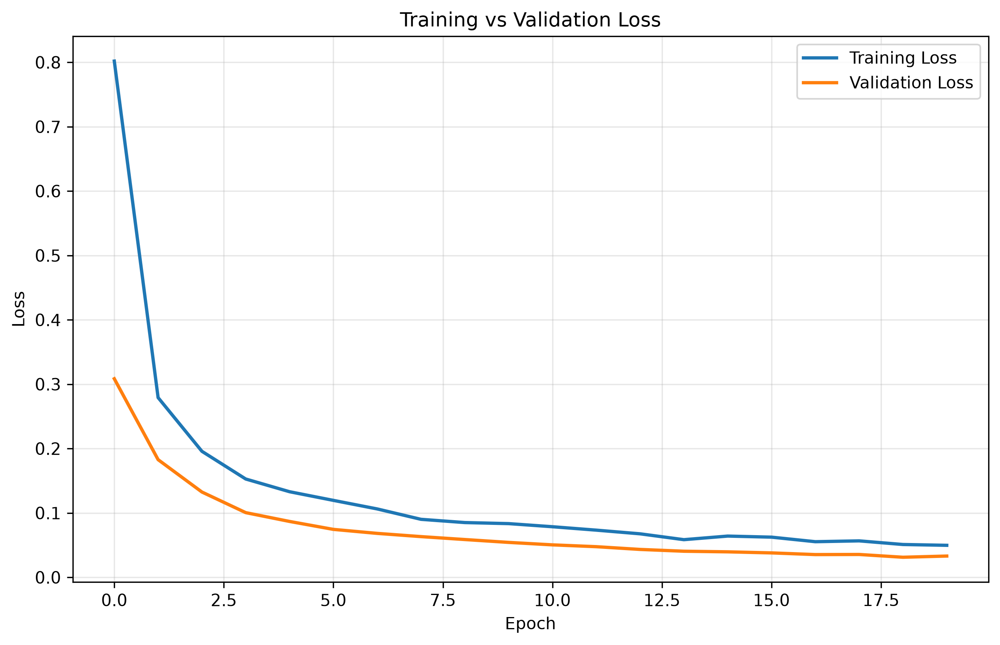
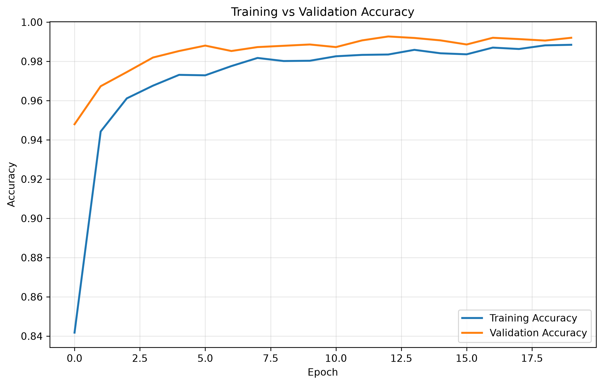
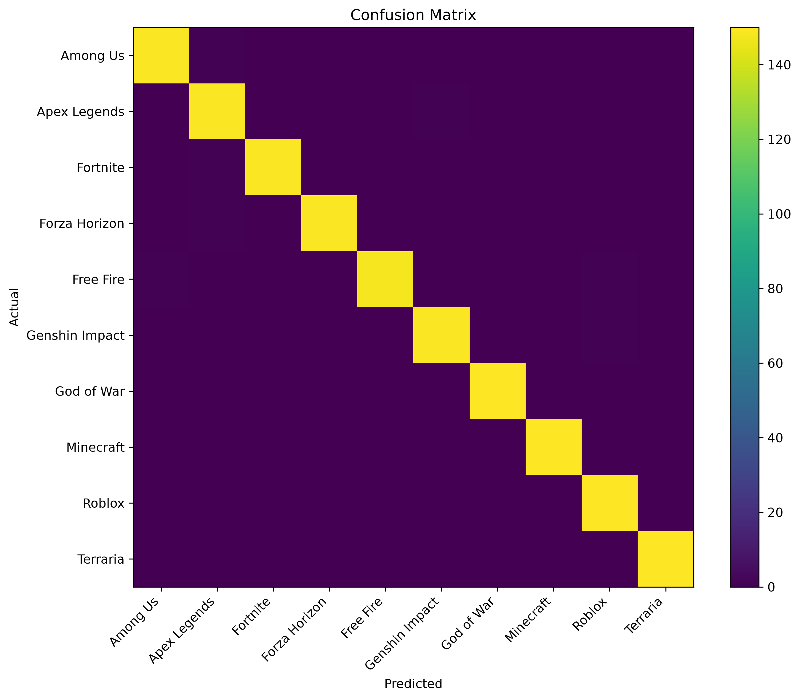
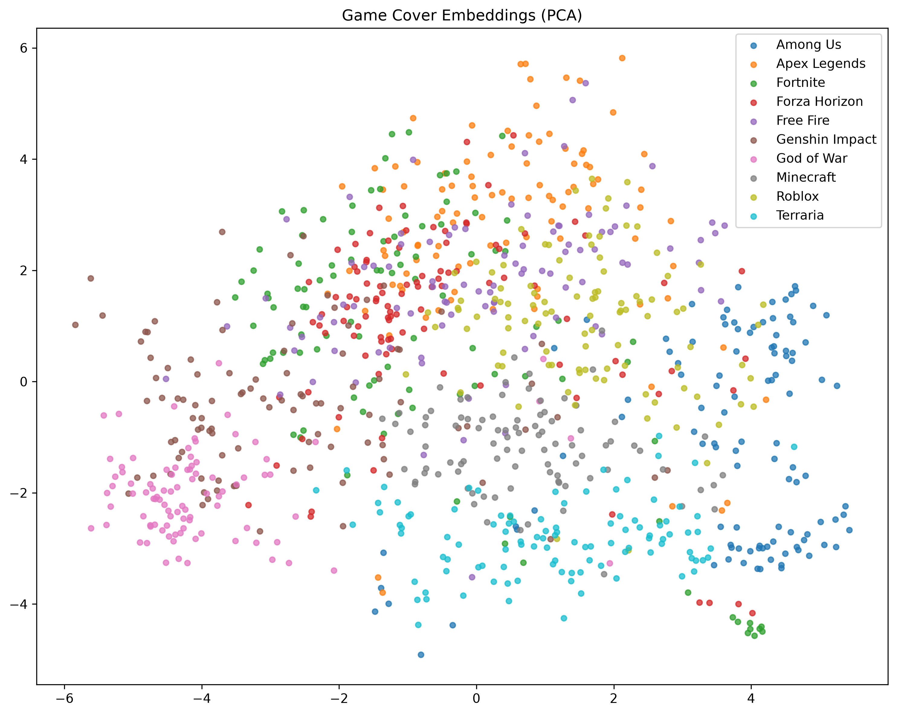
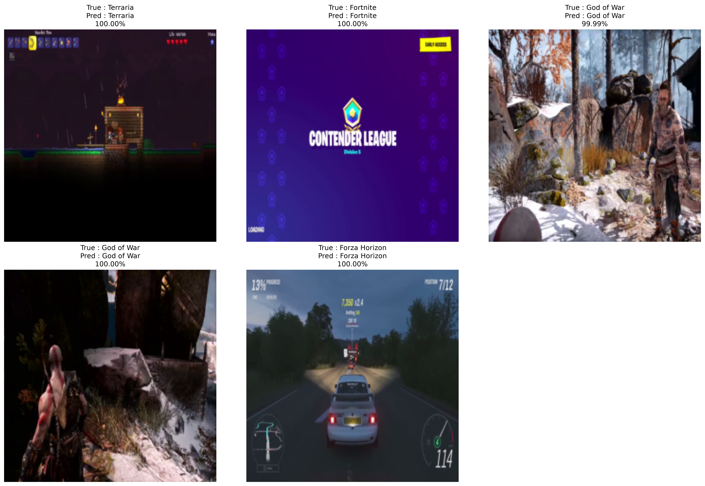
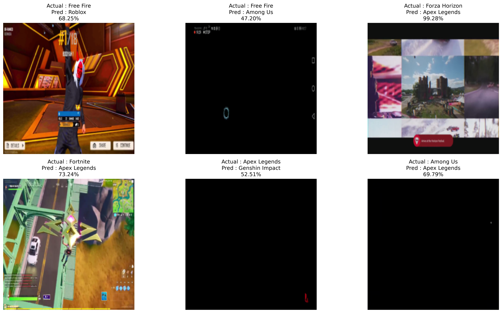

# 🎮 Video Game Cover Recognition with Transfer Learning

<p align="center">
    
</p>

<p align="center">


</p>

---

# 📖 Overview

This project demonstrates how modern computer vision systems are built using **Transfer Learning**.

Instead of training a convolutional neural network from scratch, a pretrained **ResNet50** model is adapted and fine-tuned to recognize video game covers from ten different game franchises.

The project follows an end-to-end deep learning workflow including:

- Dataset exploration
- Data preprocessing
- Transfer Learning
- Fine-Tuning
- Model Evaluation
- Explainable AI
- Feature Embedding Visualization
- Prediction Pipeline

Unlike traditional CNN projects, this implementation leverages pretrained ImageNet representations to achieve extremely high classification performance while reducing training time.

---

# 🧠 Business Problem

Digital game stores such as Steam, Epic Games Store, Xbox Store and PlayStation Store contain millions of game assets.

Automatically recognizing game cover artwork enables:

- Automatic game identification
- Visual search engines
- Duplicate cover detection
- Recommendation systems
- Digital library organization
- Store automation

---

# 🔥 Explainable AI

<p align="center">
    
</p>

The project includes Grad-CAM visualizations to explain **where the neural network focuses** before making predictions.

Instead of treating the model as a black box, Grad-CAM highlights the regions of each cover that contribute most to the final prediction.

---

# 📂 Dataset

The dataset contains:

- **10 video game classes**
- **1000 images per class**
- **10,000 total cover images**

The dataset is automatically divided into:

- Training Set
- Validation Set
- Testing Set

using stratified random splitting.

---

# ⚙️ Data Pipeline

```
Game Cover
      │
      ▼
Resize
      │
      ▼
Normalization
      │
      ▼
Data Augmentation
      │
      ▼
Pretrained ResNet50
      │
      ▼
Feature Extraction
      │
      ▼
Fine-Tuning
      │
      ▼
Prediction
      │
      ▼
Grad-CAM
      │
      ▼
Embedding Visualization
```

---

# 🏗 Model Architecture

The project uses a pretrained **ResNet50** backbone.

```
Input Image

↓

Pretrained ResNet50

↓

Global Average Pooling

↓

Dropout

↓

Linear Layer

↓

10 Game Classes
```

Training occurs in two stages.

### Stage 1

Feature Extraction

- Freeze pretrained backbone
- Train only classifier head

### Stage 2

Fine-Tuning

- Unfreeze final ResNet block
- Continue training with a very small learning rate

---

# 📈 Training Performance

<p align="center">
    
    
</p>

Training includes:

- Adam Optimizer
- CrossEntropyLoss
- Learning Rate Scheduler
- Early Stopping
- Model Checkpointing

---

# 🎯 Fine-Tuning Results

The project first trains only the classification head and later fine-tunes the final residual block.

This improves the learned representations while preserving the powerful ImageNet features.

Final Validation Accuracy reached approximately **99.5%**.

---

# 📊 Evaluation

<p align="center">
    
</p>

Evaluation metrics include:

- Accuracy
- Precision
- Recall
- F1 Score
- Top-1 Accuracy
- Top-5 Accuracy
- Classification Report
- Confusion Matrix

---

# 🌌 Embedding Space Visualization

<p align="center">
    
    
</p>

One of the most interesting aspects of Transfer Learning is that the network naturally learns a semantic feature space.

Game covers belonging to the same franchise cluster together, while visually different games separate into distinct regions.

This demonstrates that the model has learned meaningful visual representations rather than simply memorizing images.

---

# 🔍 Prediction Demo

<p align="center">
    
</p>

The prediction pipeline displays:

- Input Cover
- Predicted Game
- Prediction Confidence

---

# ❌ Misclassification Analysis

<p align="center">
    
</p>

Incorrect predictions are analyzed separately to better understand challenging cases and visually similar game covers.

---

# 📁 Project Structure

```
14-recognition-transfer-learning/

├── data/
├── models/
│     best_model.pth
│
├── notebooks/
│     transfer_learning.ipynb
│
├── outputs/
│     embeddings/
│     explainability/
│     figures/
│     metrics/
│     predictions/
│
├── README.md
├── requirements.txt
└── .gitignore
```

---

# 📊 Generated Outputs

### Figures

- Class Distribution
- Dataset Samples
- Training Loss
- Validation Accuracy
- Learning Rate
- Confusion Matrix

### Explainability

- Grad-CAM Example
- Grad-CAM Gallery

### Embeddings

- PCA Visualization
- t-SNE Visualization

### Predictions

- Prediction Demo
- Misclassified Images
- Predictions CSV

### Metrics

- Dataset Summary
- Training History
- Fine-Tuning History
- Classification Report
- Evaluation Metrics
- Model Parameters
- Training Configuration

---

# 🛠 Technologies

- Python
- PyTorch
- Torchvision
- NumPy
- Pandas
- Matplotlib
- OpenCV
- Pillow
- Scikit-learn

---

# 🎓 Concepts Covered

### Computer Vision

- Image Classification
- Data Augmentation
- Transfer Learning
- Fine-Tuning
- Feature Extraction

### Deep Learning

- ResNet50
- CrossEntropy Loss
- Adam Optimizer
- Learning Rate Scheduling
- Early Stopping
- Model Checkpointing

### Explainable AI

- Grad-CAM
- Feature Maps
- Visual Attention

### Representation Learning

- Embedding Extraction
- PCA
- t-SNE
- Feature Space Analysis

### Model Evaluation

- Accuracy
- Precision
- Recall
- F1 Score
- Top-1 Accuracy
- Top-5 Accuracy
- Confusion Matrix
- Error Analysis

---

# 🚀 Project Outcome

This project demonstrates how modern production computer vision systems leverage pretrained neural networks instead of training models entirely from scratch.

By combining Transfer Learning, Fine-Tuning, Explainable AI, and Embedding Visualization, the project showcases the complete workflow used in many real-world image recognition systems.