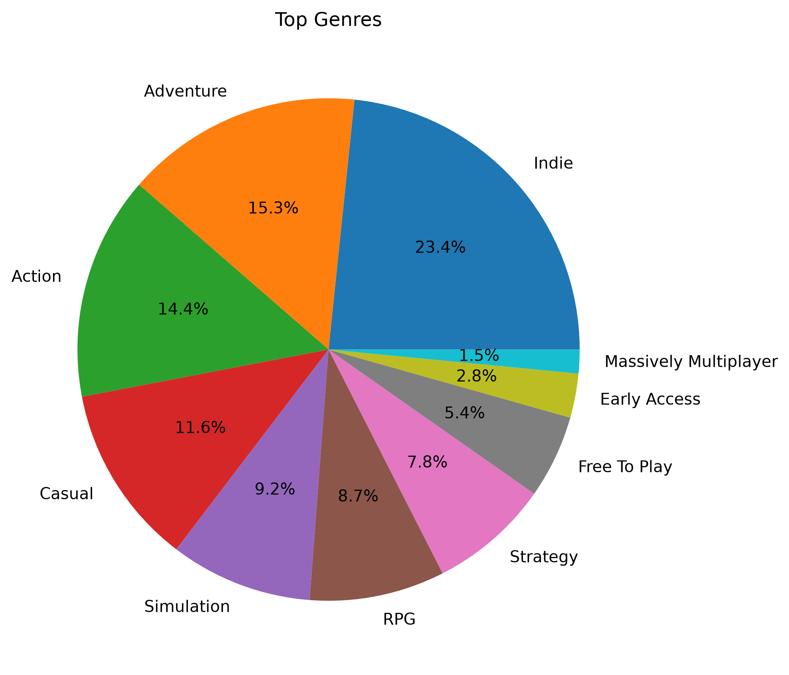
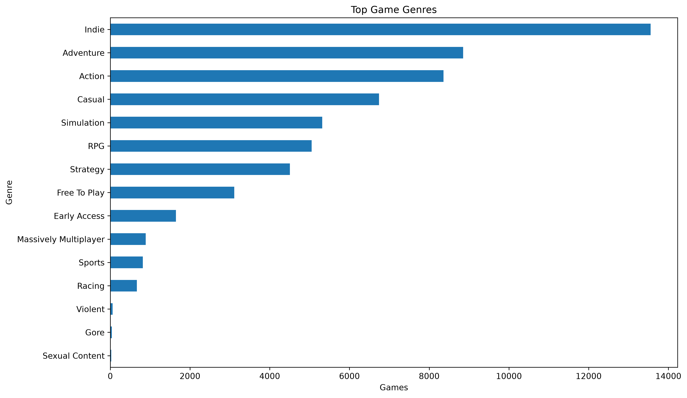
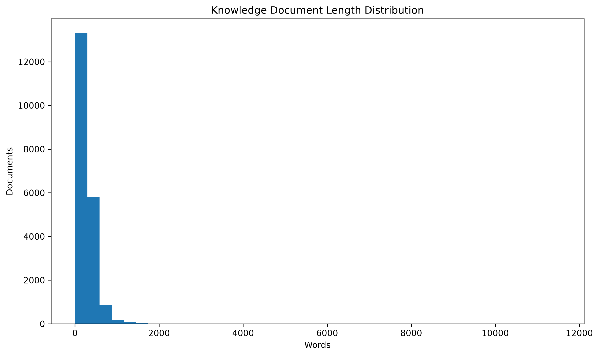
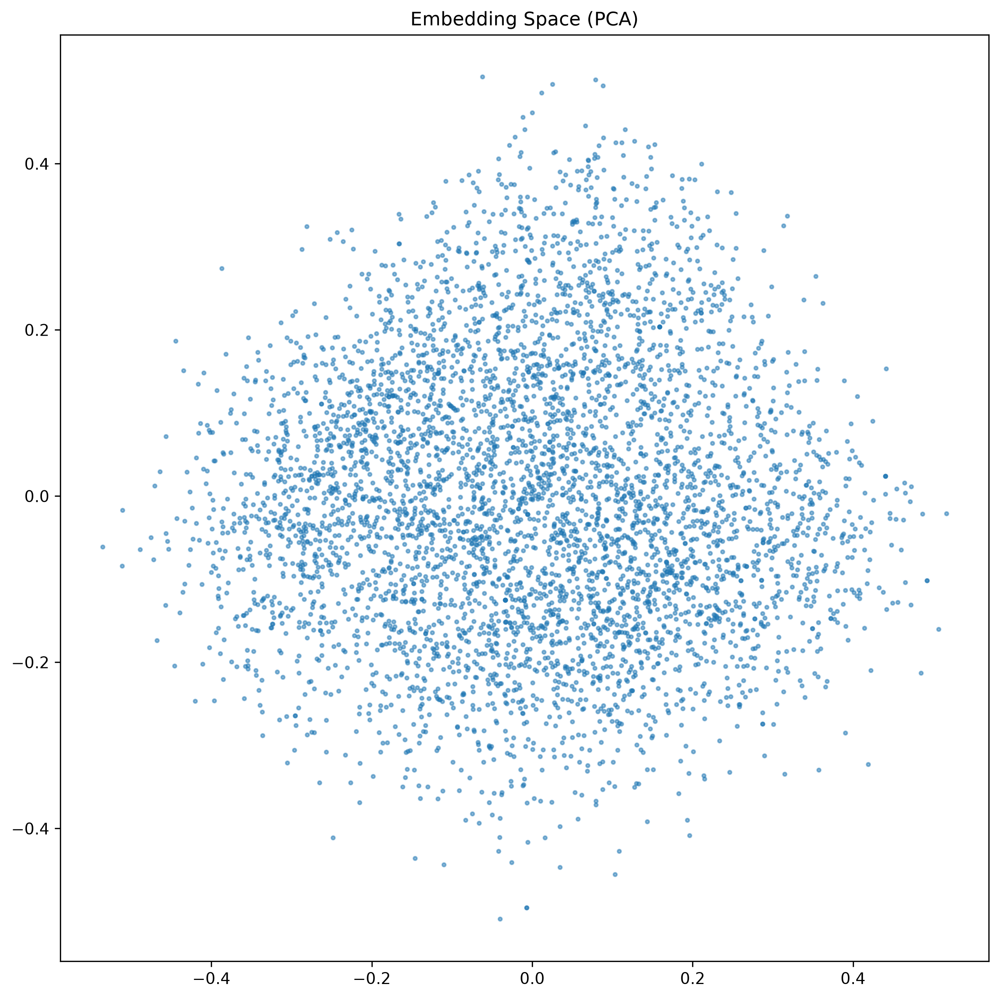
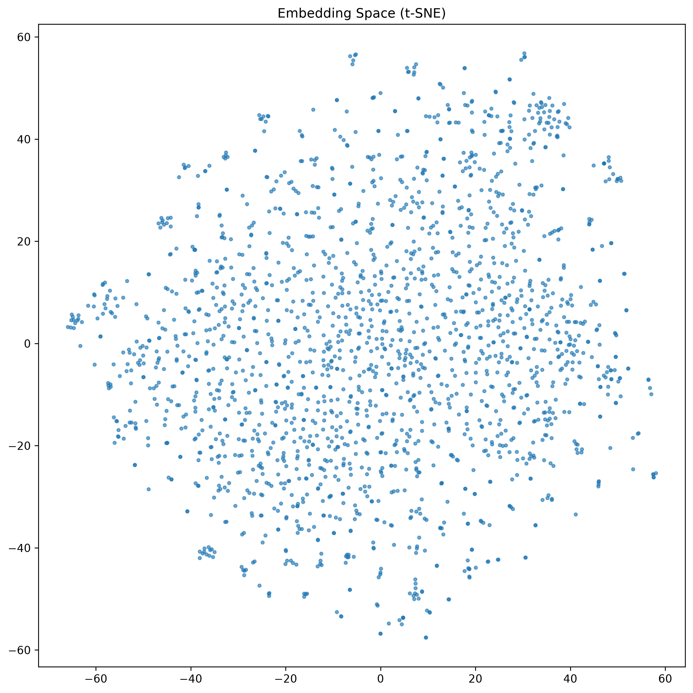
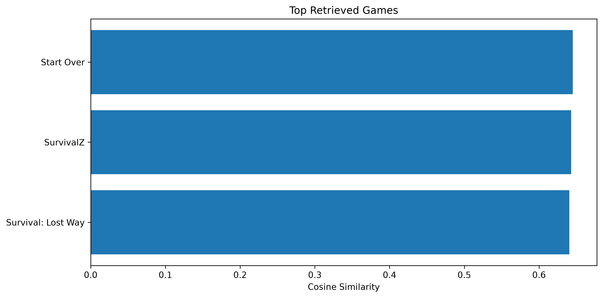
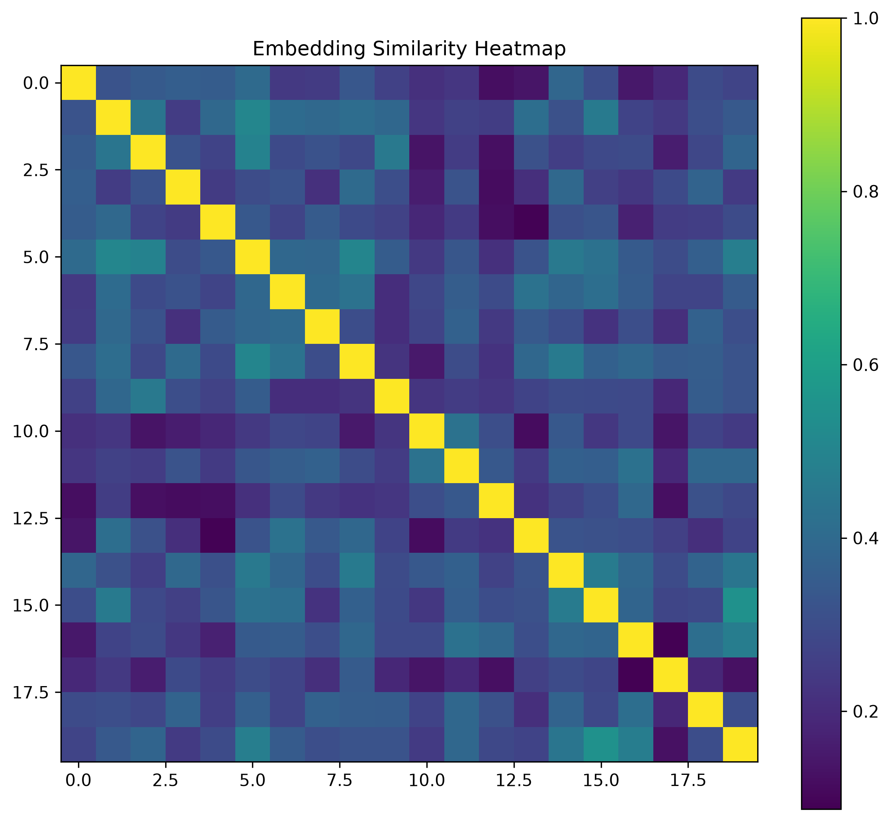
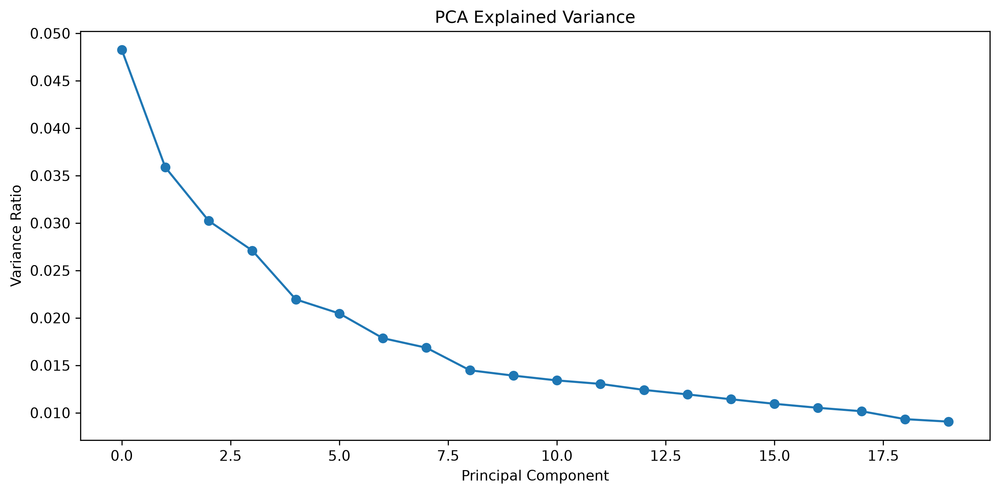

# 🧠 Local RAG Knowledge Assistant (Prototype)

> **A Retrieval-Augmented Generation (RAG) prototype that combines semantic search, vector databases, transformer embeddings, and a local Large Language Model to answer natural language questions about Steam games.**

<p align="center">
  
</p>

---

## 📖 Overview

Traditional search engines rely on **exact keyword matching**, which often fails when users describe concepts instead of specific words.

This project demonstrates how modern AI systems retrieve information **based on semantic meaning** rather than exact text. It builds a local knowledge base from over **89,000 Steam games**, converts game descriptions into dense vector embeddings using **Sentence Transformers**, indexes them with **FAISS**, retrieves the most relevant documents using vector similarity search, and finally generates natural language answers with a **local Qwen Large Language Model running through Ollama**.

The entire pipeline runs locally, making it suitable for experimentation, learning, and privacy-focused AI applications.

---

# ✨ Features

* Semantic search using transformer embeddings
* Local Retrieval-Augmented Generation (RAG) prototype
* Sentence Transformers (`all-MiniLM-L6-v2`)
* FAISS vector database
* Local Qwen LLM through Ollama
* Automatic embedding persistence
* Automatic FAISS index persistence
* Dataset validation
* Dataset cleaning and quality filtering
* Knowledge document generation
* Metadata-aware retrieval
* Similarity ranking
* Rich console interface
* Embedding visualization
* PCA projection
* t-SNE projection
* Similarity heatmaps
* Search result visualization

---

# 🧠 AI Concepts Covered

This project introduces many of the fundamental concepts used in modern Generative AI systems.

## Semantic Search

Instead of matching keywords, semantic search retrieves documents based on **meaning**.

Example

```
Query

↓

"Recommend survival crafting games"

↓

Semantic Embeddings

↓

Vector Search

↓

Relevant Games
```

---

## Sentence Transformers

The project uses the pretrained model

```
all-MiniLM-L6-v2
```

to transform every knowledge document into a **384-dimensional dense embedding**.

Instead of training a transformer from scratch, the project leverages transfer learning to generate high-quality semantic representations.

---

## Embeddings

Each Steam game description is converted into a numerical vector.

```
Game Description

↓

Embedding Model

↓

[0.14, -0.22, 0.73, ...]
```

Games discussing similar concepts become close together inside the embedding space.

---

## Vector Search

The generated embeddings are indexed using **FAISS**.

Instead of searching text directly, the application searches the vector space.

```
Query

↓

Embedding

↓

FAISS

↓

Nearest Neighbors
```

---

## Retrieval-Augmented Generation (Prototype)

After retrieving the most relevant knowledge documents, the project constructs a prompt and sends it to a local language model.

```
Question

↓

Semantic Retrieval

↓

Relevant Documents

↓

Prompt Builder

↓

Qwen (Ollama)

↓

Natural Language Answer
```

---

# 🗂 Dataset

Dataset:

**Steam Games Dataset**

The raw dataset contains

* 89,618 Steam games
* 47 attributes
* Rich game metadata
* Detailed game descriptions
* Genres
* Developers
* Publishers
* Tags
* User reviews
* Playtime statistics

---

# 🧹 Data Cleaning

Before building the knowledge base, the dataset is cleaned to improve retrieval quality.

Cleaning steps include

* Remove duplicate games
* Remove missing descriptions
* Remove placeholder titles
* Remove empty documents
* Remove games with very low review counts
* Remove HTML tags
* Normalize whitespace

This reduces noisy or low-quality entries before embedding generation.

---

# 📄 Knowledge Document Generation

Each cleaned Steam entry becomes a structured knowledge document.

Every document contains

* Game ID
* Title
* Description
* Genres
* Developers
* Publishers
* Tags
* Release Date
* Price
* Metadata

The document is later embedded into vector space.

---

# ⚙️ System Architecture

```
Steam Dataset
      │
      ▼
Dataset Loader
      │
      ▼
Dataset Validator
      │
      ▼
Text Cleaner
      │
      ▼
Knowledge Document Builder
      │
      ▼
Sentence Transformer
      │
      ▼
Dense Embeddings
      │
      ▼
FAISS Vector Index
      │
      ▼
Retriever
      │
      ▼
Prompt Builder
      │
      ▼
Qwen 2.5 (Ollama)
      │
      ▼
AI Response
```

---

# 🔍 Retrieval Pipeline

```
User Question

↓

Sentence Transformer

↓

Query Embedding

↓

FAISS Similarity Search

↓

Top-K Documents

↓

Prompt Construction

↓

Local LLM

↓

Generated Answer
```

---

# 📊 Generated Visualizations

The project automatically generates multiple visualizations for analysis and interpretation.

## Dataset Statistics

Displays the overall characteristics of the cleaned dataset.


<p align="center">
  
</p>

---

## Document Length Distribution

Shows the distribution of document sizes after preprocessing.

<p align="center">
  
</p>

---

## PCA Projection

Projects high-dimensional embeddings into two dimensions.

<p align="center">
  
</p>
---

## t-SNE Projection

Visualizes semantic clusters inside the embedding space.

<p align="center">
  
</p>

---

## Search Results

Displays similarity scores for retrieved documents.

<p align="center">
  
</p>

---

## Similarity Heatmap

Illustrates semantic similarity between embedding vectors.

<p align="center">
  
</p>

---

## PCA Explained Variance

Shows how much information is preserved across principal components.

<p align="center">
  
</p>

---

## Genre Distribution

Displays the most common genres in the filtered dataset.

<p align="center">
  
</p>

---

# 📁 Project Structure

```
16-local-RAG-assistant/

│
├── app.py
├── config.py
├── requirements.txt
│
├── dataset/
├── models/
├── outputs/
│
├── src/
│   ├── core/
│   ├── dataset/
│   ├── preprocessing/
│   ├── embeddings/
│   ├── vectorstore/
│   ├── retrieval/
│   ├── llm/
│   ├── visualization/
│   └── utils/
```

---

# 💾 Generated Files

```
models/

embeddings.npy
metadata.pkl
faiss.index
```

Generated figures

```
outputs/
└── figures/
```

---

# 🛠 Technologies

* Python
* PyTorch
* Sentence Transformers
* Transformers
* FAISS
* Ollama
* Qwen 2.5
* NumPy
* Pandas
* Scikit-learn
* Matplotlib
* Rich

---

# 💡 Example Query

```
Recommend me best survival crafting open world games.
```

The system retrieves the most semantically relevant Steam games before generating a natural language recommendation using the local language model.

---

# 📚 Project Experience

* Semantic Search
* Dense Vector Embeddings
* Sentence Transformers
* Vector Databases
* FAISS Indexing
* Retrieval-Augmented Generation
* Local LLM Inference
* Prompt Engineering
* Metadata Management
* Embedding Persistence
* Knowledge Base Construction
* Embedding Visualization
* Similarity Search
* Transformer-Based Retrieval Pipelines

---

# 🔮 Future Enhancements

This project serves as a **prototype** and provides the foundation for more advanced Retrieval-Augmented Generation systems.

Potential improvements include

* Document chunking
* Chunk overlap strategies
* Sliding-window chunking
* Metadata-aware retrieval
* Hybrid search (keyword + semantic)
* Cross-encoder reranking
* Streaming LLM responses
* Conversation memory
* Multi-turn chat
* Support for PDF, Markdown, and documentation ingestion
* Web interface
* Production deployment
* Vector database integration (Qdrant, Chroma, Milvus, Pinecone)

---

# 🎯 Conclusion

This project demonstrates the complete workflow behind a modern semantic retrieval system powered by transformer embeddings and local language models. By combining **Sentence Transformers**, **FAISS**, and **Ollama**, it showcases how Retrieval-Augmented Generation can retrieve relevant knowledge and transform it into coherent natural language responses.

As a prototype, it establishes a strong foundation for building more advanced AI assistants, enterprise search systems, and production-ready RAG applications in future projects.
