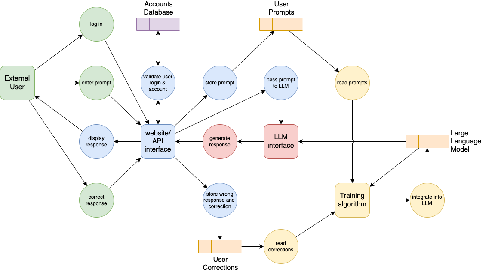

# 👁️ Vision AI Assistant (Prototype)

> **A modular Vision AI Assistant capable of understanding images, answering visual questions, extracting text, analyzing charts, interpreting diagrams, explaining user interfaces, and generating detailed image descriptions using a local Vision-Language Model (Qwen2.5-VL) running through Ollama.**

---

## 🚀 Overview

Vision AI Assistant is a **multimodal AI application** that combines **Computer Vision** and **Large Language Models (LLMs)** to reason about visual content.

Unlike traditional image classifiers that only recognize predefined categories, this assistant understands the **meaning** of an image and answers natural language questions about it.

Everything runs **100% locally** using **Ollama** and **Qwen2.5-VL**, ensuring privacy, offline usage, and complete control over the inference pipeline.

---

## ✨ Features

- 🖼️ Natural scene understanding
- 📄 OCR (Optical Character Recognition)
- 📊 Chart and dashboard analysis
- 🧩 Diagram explanation
- 💻 Code screenshot understanding
- 🖥️ User Interface (UI) explanation
- 🎮 Game screenshot analysis
- ❓ Custom visual question answering
- ⚡ Local inference using Ollama
- 📝 Automatic report generation
- 🏗️ Modular architecture

---

# 🧠 Vision-Language Models (VLMs)

Traditional LLMs only process text.

Vision-Language Models extend this capability by allowing models to understand both **images and language**.

```text
              Image
                 │
                 ▼
         Vision Encoder
                 │
      Visual Embeddings
                 │
                 ▼
         Language Model
                 │
                 ▼
      Natural Language Answer
```

The image is first converted into visual features before the language model reasons about the scene.

---

# 🏗️ Project Architecture

```text
                    User
                      │
                      ▼
              VisionAssistant
                      │
      ┌───────────────┼───────────────┐
      ▼               ▼               ▼
 Image Loader   Image Validator  Image Preprocessor
                      │
                      ▼
              Prompt Builder
                      │
                      ▼
              Ollama Client
              (Qwen2.5-VL)
                      │
                      ▼
             Vision Response
                      │
                      ▼
            Report Generator
```

The **VisionAssistant** acts as the application's orchestrator, coordinating every module while keeping each component independent and reusable.

---

# ⚙️ Processing Pipeline

Every image follows the same processing workflow.

```text
Input Image
     │
     ▼
Load Image
     │
     ▼
Validate Image
     │
     ▼
Preprocess Image
     │
     ▼
Build Vision Prompt
     │
     ▼
Qwen2.5-VL (Ollama)
     │
     ▼
Generate Response
     │
     ▼
Save Report
     │
     ▼
Display Result
```

---

# 📂 Project Structure

```text
19-vision-ai-assistant/

│
├── app.py
├── config.py
├── requirements.txt
│
├── images/
│   ├── natural/
│   ├── documents/
│   ├── charts/
│   ├── diagrams/
│   ├── games/
│   ├── ui/
│   └── code/
│
├── outputs/
│   ├── reports/
│   ├── responses/
│   └── logs/
│
├── src/
│
│   ├── llm/
│   │     ├── ollama_client.py
│   │     └── vision_response.py
│   │
│   ├── preprocessing/
│   │     ├── image_loader.py
│   │     ├── image_metadata.py
│   │     └── image_preprocessor.py
│   │
│   ├── prompting/
│   │     └── prompt_builder.py
│   │
│   ├── reporting/
│   │     └── report_generator.py
│   │
│   ├── validation/
│   │     └── image_validator.py
│   │
│   ├── vision/
│   │     └── vision_assistant.py
│   │
│   └── utils/
│
└── README.md
```

---

# 🧩 Core Components

## Image Loader

Responsible for

- loading images
- extracting metadata
- reading image properties

---

## Image Validator

Ensures every image is valid before inference.

Checks

- supported formats
- image corruption
- file size
- image dimensions

---

## Image Preprocessor

Performs lightweight preprocessing.

Supported operations

- RGB conversion
- aspect-ratio preserving resize
- thumbnail generation

---

## Prompt Builder

Creates specialized prompts for different vision tasks.

Supported prompt types

- Scene Description
- OCR
- Charts
- Diagrams
- User Interfaces
- Code
- Gaming
- General Vision QA

---

## Ollama Client

Responsible for

- connecting to Ollama
- sending images
- sending prompts
- receiving responses
- measuring inference time

---

## Vision Assistant

Coordinates the entire application workflow.

```text
Load

↓

Validate

↓

Preprocess

↓

Prompt

↓

Vision Model

↓

Response

↓

Save Report
```

---

# 🔍 Supported Vision Tasks

| Category | Example Question |
|-----------|------------------|
| Natural Scene | Describe this image |
| OCR | Extract all text |
| Chart | Explain this graph |
| Diagram | Explain this architecture |
| UI | Describe this interface |
| Code | Explain this code |
| Gaming | Which game is this? |
| General | Answer any visual question |

---

# 🧪 Example — Diagram Understanding

The assistant can reason about system architecture diagrams instead of merely recognizing objects.

### Input

<p align="center">
  
</p>

### Question

```text
Explain this diagram.
```

### AI Analysis

The Vision AI Assistant identifies:

- External user interactions
- Login and account validation
- Website/API interface
- Prompt storage
- LLM communication
- Training algorithm
- User feedback loop
- Continuous model improvement

Instead of only reading labels, the model explains how information flows through the system and summarizes the overall architecture in natural language.

This demonstrates **Visual Question Answering (VQA)** combined with **diagram understanding**, one of the key capabilities of modern Vision-Language Models.

---

# 💻 Interactive Console

The application provides a simple command-line interface for selecting different image analysis tasks.

```text
Vision AI Assistant

1. Describe Natural Scene
2. OCR / Document
3. Analyze Chart
4. Explain UI
5. Analyze Code
6. Gaming Screenshot
7. Diagram
8. Custom Question
0. Exit
```

---

# 📦 Generated Outputs

Each analysis automatically generates

```text
outputs/

reports/
responses/
logs/
```

Reports contain

- image metadata
- selected prompt
- inference time
- model name
- generated response

---

# 🛠️ Technologies

- Python
- Ollama
- Qwen2.5-VL
- Pillow
- NumPy
- Rich
- OpenCV
- Matplotlib

---

# 📚 AI Concepts Covered

This project demonstrates practical implementations of:

- Vision-Language Models (VLMs)
- Multimodal AI
- Computer Vision
- Visual Question Answering (VQA)
- OCR
- Image Captioning
- Chart Understanding
- Diagram Reasoning
- UI Understanding
- Prompt Engineering
- Local AI Inference
- Modular AI Application Design

---

# 🚀 Future Improvements

Potential enhancements include

- Batch image analysis
- PDF document support
- Webcam integration
- Object detection
- Image segmentation
- Streaming inference
- Gradio/Web interface
- Multi-image comparison
- Conversation memory
- Support for additional Vision-Language Models

---

# 📌 Project Status

This prototype successfully demonstrates a complete local Vision AI pipeline powered by a Vision-Language Model.

### Completed Features

- ✅ Modular Vision AI architecture
- ✅ Image loading and metadata extraction
- ✅ Image validation
- ✅ Image preprocessing
- ✅ Vision prompt engineering
- ✅ Local inference with Ollama and Qwen2.5-VL
- ✅ Natural scene understanding
- ✅ OCR (Optical Character Recognition)
- ✅ Chart and dashboard analysis
- ✅ Diagram reasoning
- ✅ User Interface (UI) understanding
- ✅ Code screenshot explanation
- ✅ Game screenshot analysis
- ✅ Automatic report generation
- ✅ Interactive Rich CLI

This project serves as a strong foundation for more advanced multimodal AI systems while remaining lightweight, modular, and fully local.