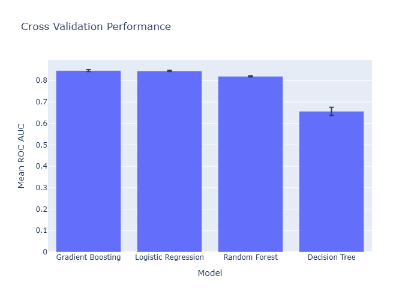
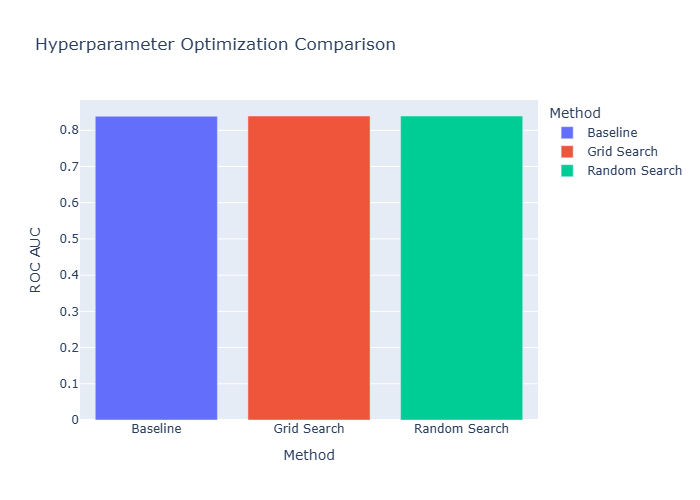
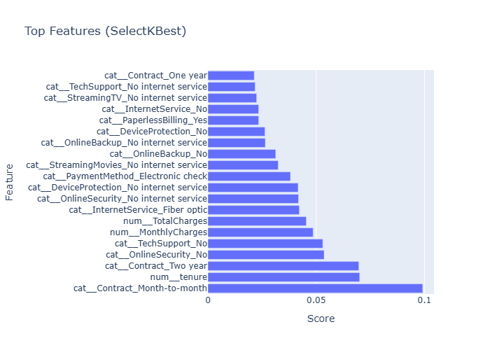
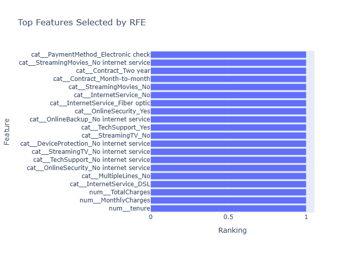
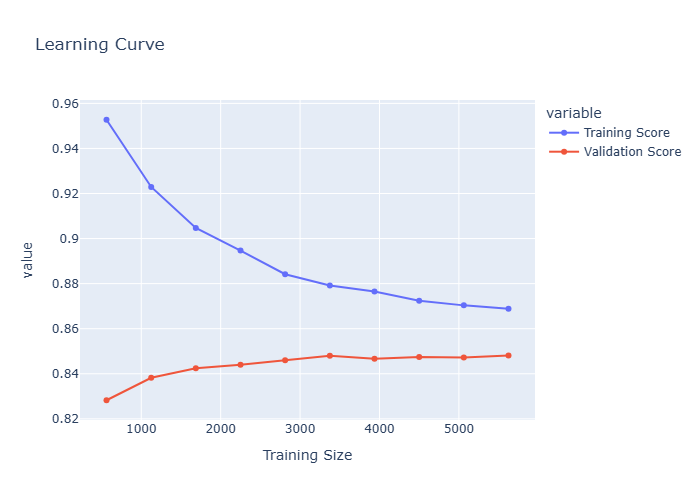
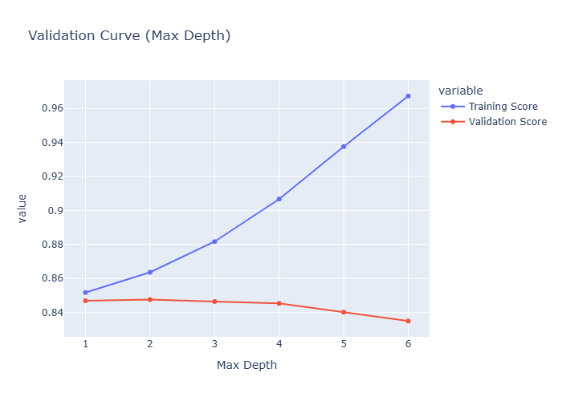
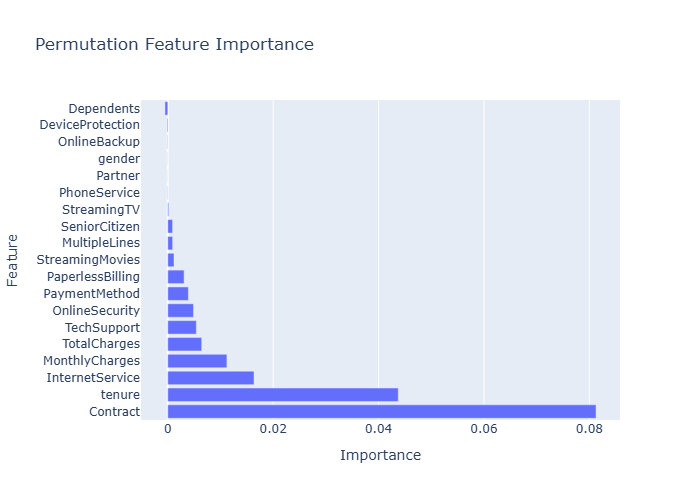
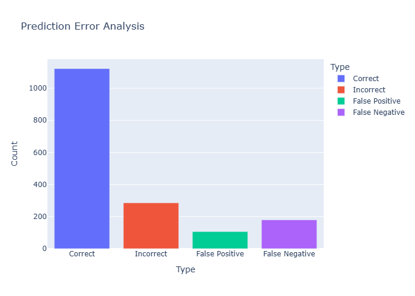

# 📉 Customer Churn Prediction & Machine Learning Optimization

> Predicting customer churn using an end-to-end Machine Learning pipeline focused on **model optimization, validation, explainability, and business insights**.

---

<p align="center">
  
</p>

---

## 📖 Overview

Customer churn is one of the most important problems in subscription-based businesses.

Retaining existing customers is often significantly less expensive than acquiring new ones. This project builds a complete Machine Learning workflow capable of predicting which customers are likely to leave while demonstrating professional optimization techniques used in real-world ML projects.

Unlike a simple classification notebook, this project focuses on:

- Multiple baseline models
- Cross-validation
- Hyperparameter optimization
- Feature selection
- Model explainability
- Error analysis
- Model persistence

---

# 🎯 Business Problem

Can we identify customers who are likely to churn before they actually leave?

Early identification enables businesses to:

- Reduce customer loss
- Improve retention strategies
- Offer targeted promotions
- Increase customer lifetime value
- Reduce acquisition costs

---

# 📊 Dataset

**Dataset**

Telco Customer Churn Dataset

**Records**

- 7,043 customers

**Target Variable**

- Churn (Yes / No)

**Features**

Examples include:

- Customer tenure
- Monthly charges
- Total charges
- Contract type
- Internet service
- Online security
- Tech support
- Payment method
- Streaming services
- Demographic information

---

# ⚙️ Machine Learning Workflow

```
Raw Dataset
      │
      ▼
Data Cleaning
      │
      ▼
Exploratory Data Analysis
      │
      ▼
Feature Engineering
      │
      ▼
Preprocessing Pipeline
      │
      ▼
Baseline Model Comparison
      │
      ▼
Cross Validation
      │
      ▼
Hyperparameter Optimization
(GridSearchCV & RandomizedSearchCV)
      │
      ▼
Feature Selection
(SelectKBest & RFE)
      │
      ▼
Learning & Validation Curves
      │
      ▼
Permutation Importance
      │
      ▼
Error Analysis
      │
      ▼
Model Persistence
```

---

# 📸 Project Screenshots

## Model Comparison

<p align="center">

</p>

Four classification algorithms were compared:

- Logistic Regression
- Decision Tree
- Random Forest
- Gradient Boosting

Gradient Boosting achieved the strongest overall performance.

---

## Cross Validation Results

<p align="center">

</p>

5-Fold Stratified Cross Validation was used to estimate model generalization performance before optimization.

---

## Hyperparameter Optimization

<p align="center">

</p>

Two optimization strategies were explored:

- GridSearchCV
- RandomizedSearchCV

The optimized Gradient Boosting model produced the best overall ROC-AUC.

---

## Feature Selection

<p align="center">

</p>

Mutual Information (SelectKBest) ranked the most predictive customer attributes.

Top business drivers included:

- Contract type
- Tenure
- Online Security
- Tech Support
- Monthly Charges

---

## Recursive Feature Elimination

<p align="center">

</p>

Recursive Feature Elimination (RFE) selected the most informative subset of features while recursively removing weaker predictors.

---

## Learning Curve

<p align="center">

</p>

Learning curves showed:

- Stable convergence
- Low variance
- Good generalization
- No significant overfitting

---

## Validation Curve

<p align="center">

</p>

Model complexity was evaluated by analyzing the impact of tree depth on training and validation performance.

---

## Permutation Feature Importance

<p align="center">

</p>

Permutation Importance provided model-agnostic explanations by measuring the performance decrease when each feature was randomly shuffled.

The most influential variables included:

- Contract
- Tenure
- Internet Service
- Monthly Charges
- Total Charges

---

## Error Analysis

<p align="center">

</p>

Prediction errors were investigated by analyzing:

- Correct predictions
- False Positives
- False Negatives
- Misclassified customers

This provides deeper insight into model behavior beyond simple accuracy metrics.

---

## ROC Curve

<p align="center">

</p>

ROC curves were used to compare classifier discrimination ability using the Area Under the Curve (ROC-AUC).

---

# 📈 Model Performance

| Model | Accuracy | ROC-AUC |
|---------|---------:|---------:|
| Logistic Regression | 80.38% | 0.836 |
| Decision Tree | 73.06% | 0.656 |
| Random Forest | 78.75% | 0.814 |
| **Gradient Boosting** | **79.67%** | **0.839** |

---

# 🧠 Machine Learning Concepts Demonstrated

## Supervised Learning

- Binary Classification
- Customer Churn Prediction

## Data Preparation

- Missing Value Handling
- Feature Engineering
- One-Hot Encoding
- Standard Scaling
- ColumnTransformer
- Pipelines

## Model Development

- Logistic Regression
- Decision Tree
- Random Forest
- Gradient Boosting

## Validation

- Stratified Train/Test Split
- Stratified K-Fold Cross Validation
- ROC-AUC Evaluation

## Hyperparameter Optimization

- GridSearchCV
- RandomizedSearchCV

## Feature Selection

- SelectKBest
- Mutual Information
- Recursive Feature Elimination (RFE)

## Explainability

- Feature Importance
- Permutation Importance
- Error Analysis

## Performance Evaluation

- Accuracy
- Precision
- Recall
- F1 Score
- ROC Curve
- ROC-AUC
- Confusion Matrix
- Learning Curves
- Validation Curves

## Model Persistence

- joblib
- Saved optimized pipeline
- Saved preprocessor
- Saved feature selector

---

# 🛠️ Technologies Used

- Python
- Pandas
- NumPy
- Scikit-learn
- Plotly
- Joblib
- Jupyter Notebook

---

# 📂 Project Structure

```
customer-churn-prediction/
│
├── data/
│
├── notebook/
│   └── churn_prediction.ipynb
│
├── models/
│   ├── best_model.pkl
│   ├── preprocessor.pkl
│   └── feature_selector.pkl
│
├── results/
│
├── screenshots/
│
├── README.md
│
└── requirements.txt
```

---

# 🚀 Future Improvements

Possible extensions include:

- XGBoost
- LightGBM
- CatBoost
- SHAP Explainability
- Optuna Hyperparameter Optimization
- Probability Calibration
- MLflow Experiment Tracking
- FastAPI Deployment
- Streamlit Dashboard

---

# 📚 Key Learning Outcomes

This project demonstrates professional Machine Learning practices including:

- End-to-end ML pipelines
- Model optimization
- Cross-validation
- Hyperparameter tuning
- Feature engineering
- Feature selection
- Explainable AI
- Error analysis
- Model persistence
- Business-focused interpretation

It represents a complete production-style Machine Learning workflow suitable for real-world customer retention problems.

---